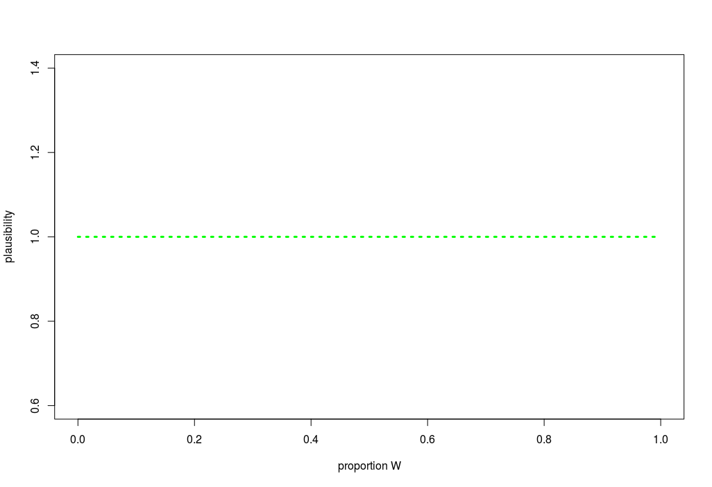
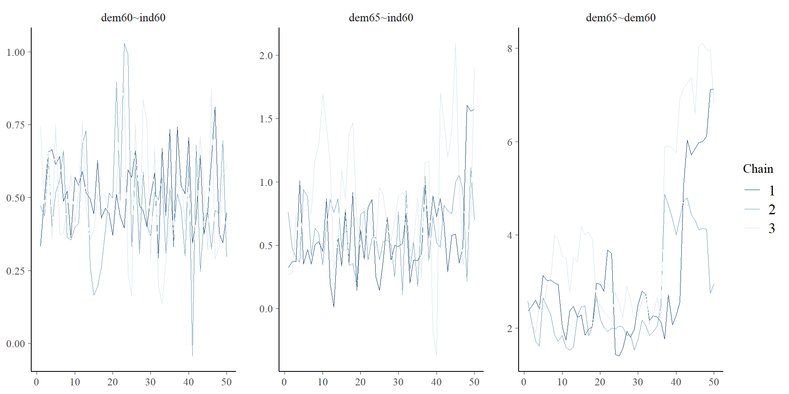
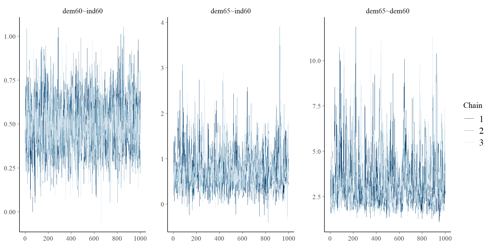
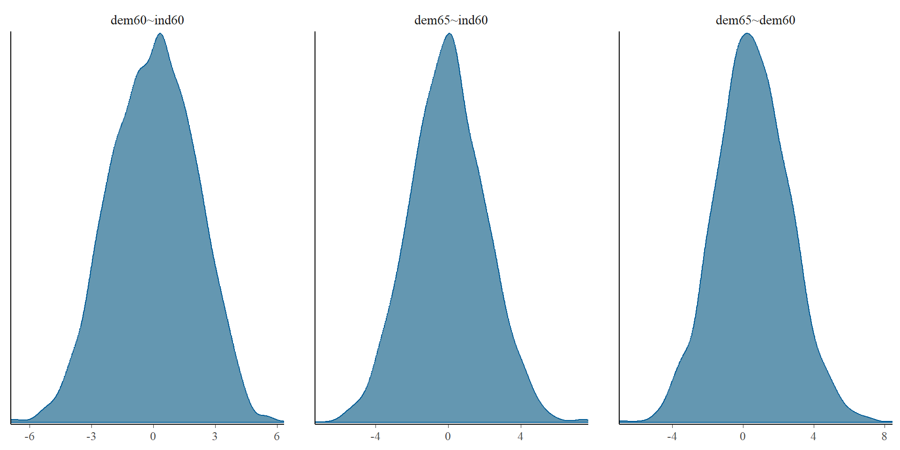
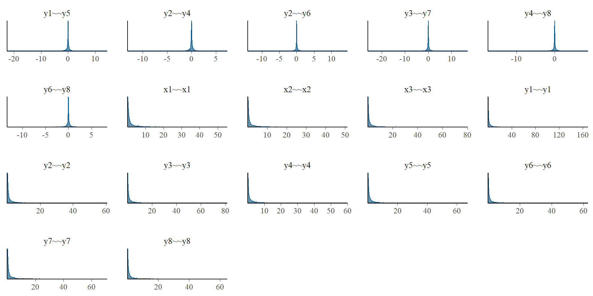
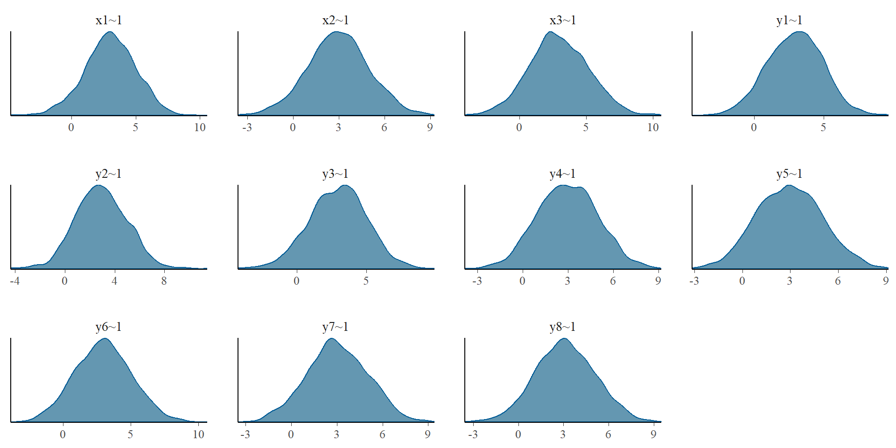
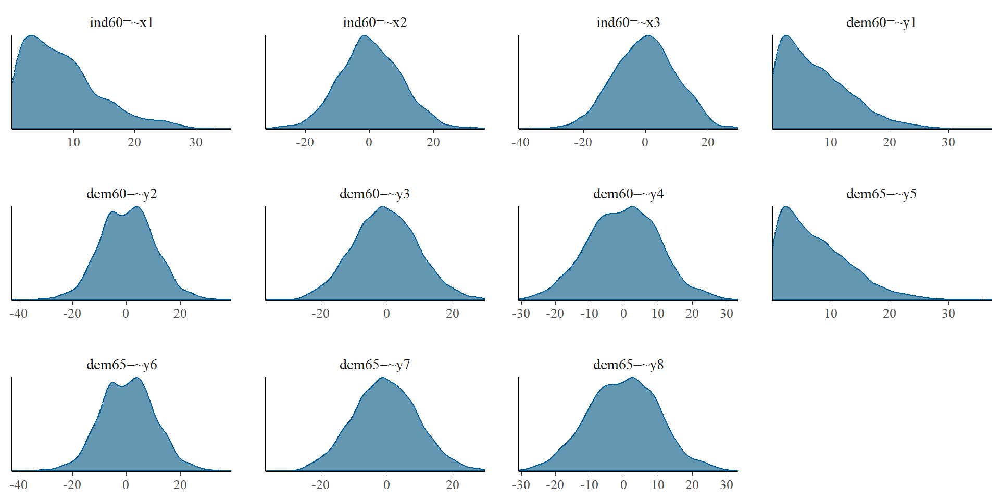
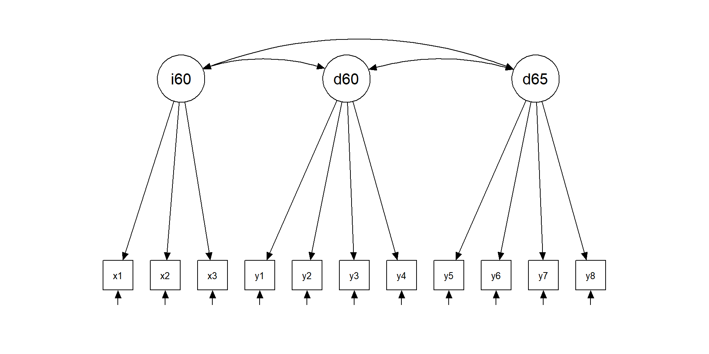
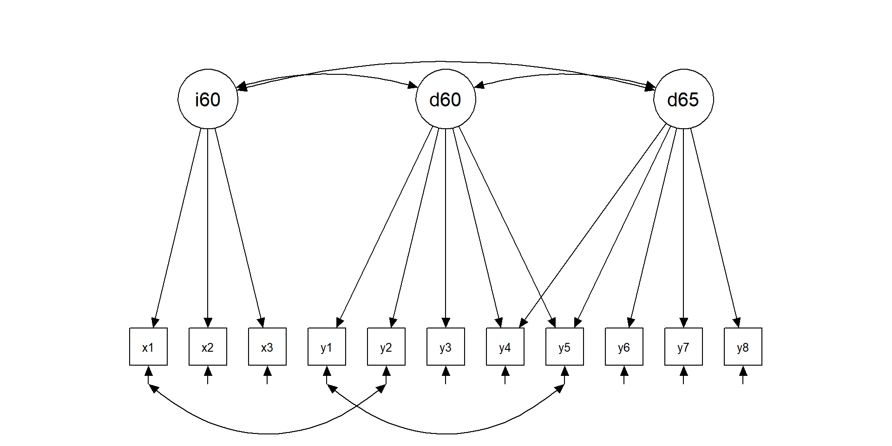
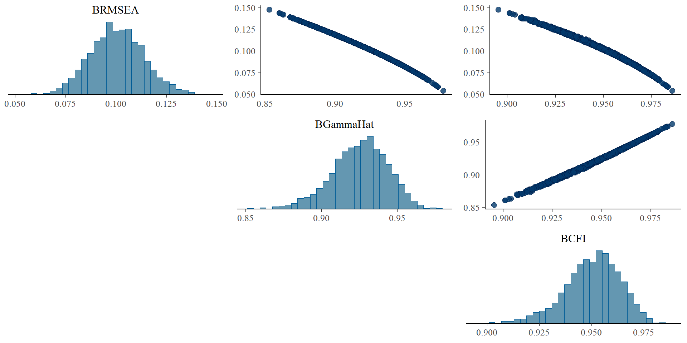

::: {.cell hash='BSEM_APS_2023_cache/revealjs/unnamed-chunk-1_7fd277731cec5222fd080c23a7c00346'}

:::


## Topics {.smaller}


- Introduction to Bayesian probability
- Evaluation of MCMC convergence and efficiency
- Priors: selection and relevance
- Prior predictive checks
- BCFA: basic measurement model
- Model fit evaluation
- Model comparison
- BSEM: basic latent regression
- Probability of direction
- What to report


# Introduction to Bayesian probability {.smaller}

## Bayesian Data Analysis

- Probability to describe uncertainty.
- Extends discrete logic (true/false) to continuous plausibility.
- Computationally difficult (MCMC). Wasn't practical to use.
- Based on Pierre-Simon Laplace and Thomas Bayes. Older than frequentist.
- Used to be controversial (still?? maybe depends of the field??) .

## Bayesian Data Analysis

- Frequentist view.
  - Probability is just limiting frequency.
  - Uncertainty arises from sampling variation.

- Bayesian view (more general).
  - Probability is part of the models.
  - Uncertainty is due to how much we don't know: How much the model doesn't know.
  
## Logic example

- WLWWWLWLW


## Design the model

- What generates the data?
- For WLWWWLWLW.

  - Some true proportion of water p
  - Toss globe, probability $p$ of observing $W$, $1-p$ of
  - Independent tosses.
 
- Probability statement.   


## Condition on the data

- Condition the model on the data.
- Update the prior with the data $\rightarrow$ posterior.
- The information is updated at each step, model is informed by the model characteristics and data.

## Starting flat 



## Update

- Observe = W


## WLWWWLWLW
    


## Condition on data

- Tosses are independent: order of data is irrelevant.
- Every posterior is a prior for next observation.
- Every prior is a posterior of some other inference.

## Evaluate the model

- Bayesian inference: logical answer to a question.
- Answers are in form of distributions.
- You guide the model.
  - Was there a problem.
  - Makes sense.
  - Sensitivity.

## Bayesian Model

- Assume:
  - Likelihood. 
  - Parameters.
  - Priors.
- Produce: Posterior.

## Likelihood

- $Pr(data|assumptions)$
  - Probability of observations conditional on assumptions/model.
  - Mathematical form of how the data happens.
- In frequentist: $Pr(data|Ho)$
  - Probability of the data if the null hypothesis is true.
- In the globe example: binomial probability:
  - Probability of getting a 1 in a toss: coin, globe, etc.    

## Parameters

- Parameters that define the probability function of the likelihood.
- What parameters define the distribution that you specify for the data.
- Depends of the likelihood function:
  - Normal: mean, sd.
  - Binomial: $p$

## Prior


- Original believe/knowledge/information for the parameters.
- Define as distribution.
- You always know “something”.
  - Globe example: uniform
  


## Prior

- $P(\theta)$ is the prior distribution represents some prior belief or information (without seeing data) about the distribution of $\theta$ .
- By specifying a density function we expect $\theta$ to follow, we can then estimate the form of the posterior for parameters.

## Posterior and Bayes Rule/Theorem {.smaller}

- Bayesian estimate is a posterior distribution over parameters $Pr(parameters|data)$.
- We can solve for the posterior distribution $Pr(\theta|y)$, represents the probability for our parameter($s$) of interest ($\theta$), given data ($y$)
  
   
$$ 
p(\theta|y) = \frac{p(\theta,y)}{p(y)} = \frac{p(y|\theta)p(\theta)}{p(y)}
$$
    
$$
p(\theta|y) \propto p(y|\theta)p(\theta)
$$
    
## Posterior

- We describe the distribution: point estimate, sd, intervals, etc.
- Posterior quantifies the uncertainty about $\theta$, conditional on data.
- You decide how you describe it, what is meaningful for your research question.


## p-value
  

- $Pr(y|\theta) = P(y > Y|H_{0})$.
- Probability of the data coming from a population where the Null Hypothesis is TRUE.
- Probability of observing data ($y$) past a threshold ($Y$), given a null hypothesis is true.
- Major problems: 1) people misinterpret this ALL the time, 2) it is not the inference you really want.


## The tyranny of the $p$-value

- People frequently confuse $Pr(y > Y|H_{0})$ with $Pr(H0|y > Y)$. If the probability of the data, given the null is true, is small, the probability that the null is true, given the data, must be small, too, right?!RIGHT?! Sadly NO.
- With the Bayes rule, we know they are only equal if the marginal probability of H0 being true is equal to the marginal probability of data being greater than or equal to the threshold.
  - There is no reason to think that is the case.

## Frequentists vs. Bayesians

- Frequentist
   “What is the likelihood of observing these data, given the parameter(s) of the model?”
Maximum likelihood methods basically work by iteratively finding values for q that maximize this function.

- Bayesian 
   “What is the distribution of the parameters, given the data?”
A Bayesian is interested in how the parameters can be inferred from the data, not how the data would have been inferred from the parameters.
   
## The “P” you really want to know

- We will not be rejecting any null hypotheses in here. We will make direct probabilistic inferences about the values of our parameters of interest. A Bayesian can always express the probability that (for example) a mean difference is greater than zero, if desired. But what’s almost certainly more interesting is the inference about how large the mean difference between the groups really is!


# Convergence and Efficiency Evaluation

## Terms
- Iterations: number to times we want the MCMC algorithm to run (estimate)
  - Burnin: number of iteration to use to calibrate the model find a stable solution
  - Sample: number of iterations to save after burnin, to build the posterior distributions
- Chains: number of times we estimate models N-iterations, with different starting values
- Thin: number of sample iterations to skip over (only recommended to save memory space)

## Convergence {.smaller}

- When Bayesian models estimated with Markov-Chain Monte Carlo (MCMC) sampler, the models dont stop when it has achieve some convergence criteria, it will run as long as you set it to, and then you need to evaluate the convergence and efficiency of the estimated posterior distributions. And only analyze the results if they are stable enough. 
- $\hat{R}$ is the convergence diagnostic, which compares the between- and within-chain estimates for model parameters and other univariate quantities of interest [@new_rhat]. 
- If chains have not mixed well (ie, the between- and within-chain estimates don't agree), $\hat{R}$ is larger than 1. We recommend running at least three chains by default and only using the sample if $\hat{R} < 1.05$ for all the parameters. 

## Convergence

- If all $\hat{R} < 1.05$ then we can establish that the MCMC chains have converged to a stable solution. If the model has not converged, you should increase the number of ```burnin``` iterations
- and/or change the model priors. As the model might have failed to converge due to needing more iterations or a model misspecification (such as bad priors)

## Convergence


::: {.cell hash='BSEM_APS_2023_cache/revealjs/unnamed-chunk-3_31fa71f1dee35c18681b207e952c02b4'}
::: {.cell-output-display}
{width=960}
:::
:::


## Convergence


::: {.cell hash='BSEM_APS_2023_cache/revealjs/unnamed-chunk-5_e6ee1874a8758555b2414d9de9cbaa12'}
::: {.cell-output-display}
{width=960}
:::
:::


## Efficiency {.smaller}

- Effective sample size (ESS) measures sampling efficiency in the distribution (related e.g. to efficiency of mean and median estimates), and is well defined even if the chains do not have finite mean or variance [@new_rhat].
- ESS can be interpreted as the number of posterior draws that are completely independent of each other, with auto-correlations of 0
- ESS should be at least 100 (approximately) per Markov Chain in order to be reliable and indicate that estimates of respective posterior quantiles are reliable, e.g.: $ESS > 300$ with 3 chains for every parameter

# Priors: selection and relevance

## Priors

- $p(\theta)$ is the “prior distribution”
- Represents your knowledge and level of uncertainty
- Represented as probability distributions
- The inclusion of priors is a strength not a weakness.
- Bayesian inference can implement cumulative scientific progress with the inclusion of previous knowledge into the specification of the prior uncertainty

## Sample size
- Frequentist statistics are asymptotically correct
- Bayesian is estimate in function the know data
- Small samples have a better representation with Bayesian statistics.
- It does not mean is perfect, you are still limited by
your data

## Prior: advantages
- Include prior knowledge
- Account for uncertainty
- Allow us to set clear boundaries, meaningful for the theory
- Theory driven
- Heps stabilize models with smaller sample sizes

## Prior: disadvantages
- More decisions to make
- Can bias the results if they are strong in the wrong place
- Bad priors can make the model take longer to converge
- More effect with smaller sample sizes

## Priors

- Non informative (diffuse)
- Weakly informative
- Strongly informative

- The different types relate to the amount of
uncertainty
- The recommended standard one is weakly
informative
- Apologetic Bayesian prefer non informative

## Non informative Priors

- Intend to have large variances, implying large uncertainty
- Telling the model that you have no notion of where the parameters are located
- Try to be as similar as possible to ML, since in ML every parameter value is possible
- Even if the parameters are equal to ML, the inference is never the same
- $p(\theta) \sim N(0, 100000)$
- $p(\theta) \sim U(-10000, 10000)$

## Non informative Priors

- Even as they are called "non informative"
- It is believed that if the prior tells the model that many values are possible, then it is not providing information
- Actually, it is providing a lot of information, bad information, telling the model that outlier values are possible
- Better to called them "diffuse" for the lack of clarity and quality of the information

## Weakly informative Priors

- Represents a reasonable level of uncertainty
- It does not intend to drive the parameters/posterior
- Intends to set a reasonable parameter space (boundaries)
- Theory/data driven
- $p(\theta) \sim N(0, 10)$
- $p(\theta) \sim U(0, 100)$

## Strongly informative Priors

- Represents a low level of uncertainty
- Usually use to present specific hypothesis
- Not recommended for general use in parameters
- $p(\theta) \sim N(0, .05)$
- $p(\theta) \sim U(0, 1)$

## Priors

- Have more influence on the posterior for smaller samples
- Consider theory, data, and model characteristics
- Are scale dependent, what is a weakly informative prior in one case might be strong in another
- The "intended" priors might differ from the priors in the model due to model constraints, as opaque priors [@merkle2023opaque]

# Prior predictive checks

## Prior predictive checks (PPC)

- Generate data from the priors in order to asses whether a prior is appropriate [@Gabry_2019_vis]. 
- A posterior predictive check generates replicated data according to the posterior predictive distribution. 
- In contrast, the prior predictive check generates data according to the prior predictive distribution 

$y^{sim} ∼ p(y)$

## Prior predictive checks (PPC)

- Like the posterior predictive distribution with no observed data, so that a PPC is nothing more than the limiting case of a posterior predictive check with no data.
- Simulating parameters $θ^{sim}∼p(\theta)$ according to the priors, then simulating data $y^{sim}∼p(y∣ \theta^{sim})$  according to the sampling distribution given the simulated parameters
- The result is a simulation from the joint distribution, $(y^{sim},θ^{sim})∼p(y,\theta)$ and thus $y^{sim}∼p(y)$ is a simulation from the prior predictive distribution.

## Prior predictive checks (PPC)


::: {.cell hash='BSEM_APS_2023_cache/revealjs/unnamed-chunk-7_7410a700897de90829f5ba7a4bf76da6'}

```{.r .cell-code  code-fold="false"}
priors <- dpriors(nu="normal(3,2)",
                  lambda="normal(0.4, 2)",
                  beta="normal(0.4, 2)",
                  theta="gamma(1,1)[sd]")

model <- '
  # latent variable definitions
     ind60 =~ x1 + x2 + x3
     dem60 =~ a*y1 + b*y2 + c*y3 + d*y4
     dem65 =~ a*y5 + b*y6 + c*y7 + d*y8

  # regressions
    dem60 ~ ind60
    dem65 ~ ind60 + dem60

  # residual correlations
    y1 ~~ y5
    y2 ~~ y4 + y6
    y3 ~~ y7
    y4 ~~ y8
    y6 ~~ y8
'

fit_wi <- bsem(model, data=PoliticalDemocracy, std.lv=T,
            meanstructure=T, test = "none",
            dp=priors, prisamp = T)
```
:::


## Prior predictive checks (PPC)


::: {.cell hash='BSEM_APS_2023_cache/revealjs/unnamed-chunk-8_05a53ed150dd49c655176ec5c40c82c7'}

```{.r .cell-code  code-fold="false"}
## factor loadings
plot(fit_wi, pars=1:11, plot.type = "dens")
```

::: {.cell-output-display}
{width=960}
:::
:::


## Prior predictive checks (PPC)


::: {.cell hash='BSEM_APS_2023_cache/revealjs/unnamed-chunk-9_93680fc92db34d9b15fd71355c8e4b77'}

```{.r .cell-code  code-fold="false"}
## factor regressions
plot(fit_wi, pars=12:14, plot.type = "dens")
```

::: {.cell-output-display}
{width=960}
:::
:::


## Prior predictive checks (PPC)


::: {.cell hash='BSEM_APS_2023_cache/revealjs/unnamed-chunk-10_e6d99dce903f85849896810a5256265e'}

```{.r .cell-code  code-fold="false"}
## residual variances
plot(fit_wi, pars=15:31, plot.type = "dens")
```

::: {.cell-output-display}
{width=960}
:::
:::


## Prior predictive checks (PPC)


::: {.cell hash='BSEM_APS_2023_cache/revealjs/unnamed-chunk-11_09f0a310f47b6e38dadb8fced940b3fd'}

```{.r .cell-code  code-fold="false"}
## item intercepts
plot(fit_wi, pars=32:42, plot.type = "dens")
```

::: {.cell-output-display}
{width=960}
:::
:::


## Prior predictive checks (PPC)

- Default priors

::: {.cell hash='BSEM_APS_2023_cache/revealjs/unnamed-chunk-12_cc5c67d7c7ff273f4def288e53d67bc7'}

```{.r .cell-code  code-fold="false"}
dpriors()
```

::: {.cell-output .cell-output-stdout}
```
               nu             alpha            lambda              beta 
   "normal(0,32)"    "normal(0,10)"    "normal(0,10)"    "normal(0,10)" 
            theta               psi               rho             ibpsi 
"gamma(1,.5)[sd]" "gamma(1,.5)[sd]"       "beta(1,1)" "wishart(3,iden)" 
              tau 
  "normal(0,1.5)" 
```
:::
:::


::: {.cell hash='BSEM_APS_2023_cache/revealjs/unnamed-chunk-14_40ddca3609aa959d965f316582f6136f'}

```{.r .cell-code  code-fold="false"}
fit_df <- bsem(model, data=PoliticalDemocracy, std.lv=T,
            meanstructure=T, test = "none",
            prisamp = T)
```
:::


## Prior predictive checks (PPC)


::: {.cell hash='BSEM_APS_2023_cache/revealjs/unnamed-chunk-15_ae90b893adc36c259418f591def84c7a'}

```{.r .cell-code  code-fold="false"}
## factor loadings
plot(fit_df, pars=1:11, plot.type = "dens")
```

::: {.cell-output-display}
{width=960}
:::
:::


## Prior predictive checks (PPC)


::: {.cell hash='BSEM_APS_2023_cache/revealjs/unnamed-chunk-16_62504fec39158fa98619a45edf079533'}

```{.r .cell-code  code-fold="false"}
## factor regressions
plot(fit_df, pars=12:14, plot.type = "dens")
```

::: {.cell-output-display}
{width=960}
:::
:::


## Prior predictive checks (PPC)


::: {.cell hash='BSEM_APS_2023_cache/revealjs/unnamed-chunk-17_4338c271df962d3f61b9a871fabfe9e0'}

```{.r .cell-code  code-fold="false"}
## residual variances
plot(fit_df, pars=15:31, plot.type = "dens")
```

::: {.cell-output-display}
{width=960}
:::
:::


## Prior predictive checks (PPC)


::: {.cell hash='BSEM_APS_2023_cache/revealjs/unnamed-chunk-18_08c89129513d020c50a13635d496df80'}

```{.r .cell-code  code-fold="false"}
## item intercepts
plot(fit_df, pars=32:42, plot.type = "dens")
```

::: {.cell-output-display}
{width=960}
:::
:::


# BCFA: basic measurement model

## CFA: measurement models
- A construct is what the indicators share


## Bayesian CFA

For this example we will use the Industrialization and Political Democracy example [@bollen_structural_1989]


::: {.cell hash='BSEM_APS_2023_cache/revealjs/unnamed-chunk-19_0cfd1344ccc2791b240f733e19f87279'}

:::

::: {.cell hash='BSEM_APS_2023_cache/revealjs/unnamed-chunk-20_1bd97f574efa20f2b0c724d5d671e2fe'}
::: {.cell-output-display}
{width=960}
:::
:::


## Bayesian CFA


::: {.cell hash='BSEM_APS_2023_cache/revealjs/unnamed-chunk-21_c4cfd44b7f24b778db8d9eed18fb2c02'}

:::

::: {.cell hash='BSEM_APS_2023_cache/revealjs/unnamed-chunk-22_fb5b09f92db0124320b3b52fa42da90a'}
::: {.cell-output-display}
{width=960}
:::
:::


## Measurement models

-A model is fitted to data and all models are wrong to some degree, the data may not be explained perfectly
- Interpretations must involve a subjective component and solutions will not make sense
- Model fit should be evaluated
- Tests theoretical structure

## Bayesian CFA

- Basic measurement model (default priors)

::: {.cell hash='BSEM_APS_2023_cache/revealjs/unnamed-chunk-23_1ec1b6eabbe5421f301f728d580d41f4'}

```{.r .cell-code  code-fold="false"}
mod1 <- '
  # latent variable definitions
     ind60 =~ x1 + x2 + x3
     dem60 =~ y1 + y2 + y3 + y4
     dem65 =~ y5 + y6 + y7 + y8'

f1 <- bcfa(mod1, data=PoliticalDemocracy, 
           meanstructure=T, std.lv=T,
           burnin=1000, sample=1000, n.chains=3)
```

::: {.cell-output .cell-output-stdout}
```

SAMPLING FOR MODEL 'stanmarg' NOW (CHAIN 1).
Chain 1: 
Chain 1: Gradient evaluation took 0 seconds
Chain 1: 1000 transitions using 10 leapfrog steps per transition would take 0 seconds.
Chain 1: Adjust your expectations accordingly!
Chain 1: 
Chain 1: 
Chain 1: Iteration:    1 / 2000 [  0%]  (Warmup)
Chain 1: Iteration:  200 / 2000 [ 10%]  (Warmup)
Chain 1: Iteration:  400 / 2000 [ 20%]  (Warmup)
Chain 1: Iteration:  600 / 2000 [ 30%]  (Warmup)
Chain 1: Iteration:  800 / 2000 [ 40%]  (Warmup)
Chain 1: Iteration: 1000 / 2000 [ 50%]  (Warmup)
Chain 1: Iteration: 1001 / 2000 [ 50%]  (Sampling)
Chain 1: Iteration: 1200 / 2000 [ 60%]  (Sampling)
Chain 1: Iteration: 1400 / 2000 [ 70%]  (Sampling)
Chain 1: Iteration: 1600 / 2000 [ 80%]  (Sampling)
Chain 1: Iteration: 1800 / 2000 [ 90%]  (Sampling)
Chain 1: Iteration: 2000 / 2000 [100%]  (Sampling)
Chain 1: 
Chain 1:  Elapsed Time: 6.956 seconds (Warm-up)
Chain 1:                5.995 seconds (Sampling)
Chain 1:                12.951 seconds (Total)
Chain 1: 

SAMPLING FOR MODEL 'stanmarg' NOW (CHAIN 2).
Chain 2: 
Chain 2: Gradient evaluation took 0 seconds
Chain 2: 1000 transitions using 10 leapfrog steps per transition would take 0 seconds.
Chain 2: Adjust your expectations accordingly!
Chain 2: 
Chain 2: 
Chain 2: Iteration:    1 / 2000 [  0%]  (Warmup)
Chain 2: Iteration:  200 / 2000 [ 10%]  (Warmup)
Chain 2: Iteration:  400 / 2000 [ 20%]  (Warmup)
Chain 2: Iteration:  600 / 2000 [ 30%]  (Warmup)
Chain 2: Iteration:  800 / 2000 [ 40%]  (Warmup)
Chain 2: Iteration: 1000 / 2000 [ 50%]  (Warmup)
Chain 2: Iteration: 1001 / 2000 [ 50%]  (Sampling)
Chain 2: Iteration: 1200 / 2000 [ 60%]  (Sampling)
Chain 2: Iteration: 1400 / 2000 [ 70%]  (Sampling)
Chain 2: Iteration: 1600 / 2000 [ 80%]  (Sampling)
Chain 2: Iteration: 1800 / 2000 [ 90%]  (Sampling)
Chain 2: Iteration: 2000 / 2000 [100%]  (Sampling)
Chain 2: 
Chain 2:  Elapsed Time: 7.006 seconds (Warm-up)
Chain 2:                5.818 seconds (Sampling)
Chain 2:                12.824 seconds (Total)
Chain 2: 

SAMPLING FOR MODEL 'stanmarg' NOW (CHAIN 3).
Chain 3: 
Chain 3: Gradient evaluation took 0.001 seconds
Chain 3: 1000 transitions using 10 leapfrog steps per transition would take 10 seconds.
Chain 3: Adjust your expectations accordingly!
Chain 3: 
Chain 3: 
Chain 3: Iteration:    1 / 2000 [  0%]  (Warmup)
Chain 3: Iteration:  200 / 2000 [ 10%]  (Warmup)
Chain 3: Iteration:  400 / 2000 [ 20%]  (Warmup)
Chain 3: Iteration:  600 / 2000 [ 30%]  (Warmup)
Chain 3: Iteration:  800 / 2000 [ 40%]  (Warmup)
Chain 3: Iteration: 1000 / 2000 [ 50%]  (Warmup)
Chain 3: Iteration: 1001 / 2000 [ 50%]  (Sampling)
Chain 3: Iteration: 1200 / 2000 [ 60%]  (Sampling)
Chain 3: Iteration: 1400 / 2000 [ 70%]  (Sampling)
Chain 3: Iteration: 1600 / 2000 [ 80%]  (Sampling)
Chain 3: Iteration: 1800 / 2000 [ 90%]  (Sampling)
Chain 3: Iteration: 2000 / 2000 [100%]  (Sampling)
Chain 3: 
Chain 3:  Elapsed Time: 7.653 seconds (Warm-up)
Chain 3:                5.789 seconds (Sampling)
Chain 3:                13.442 seconds (Total)
Chain 3: 
Computing posterior predictives...
```
:::
:::


## Convergence and efficiency

- Convergence

::: {.cell hash='BSEM_APS_2023_cache/revealjs/unnamed-chunk-24_5444d8f37a4f9d2837796ebd68f18d51'}

```{.r .cell-code  code-fold="false"}
max(blavInspect(f1, "psrf"))
```

::: {.cell-output .cell-output-stdout}
```
[1] 1.005153
```
:::
:::


- Efficiency

::: {.cell hash='BSEM_APS_2023_cache/revealjs/unnamed-chunk-25_30c0a261b9b998ce5b3226d3c70a55e9'}

```{.r .cell-code  code-fold="false"}
min(blavInspect(f1, "neff"))
```

::: {.cell-output .cell-output-stdout}
```
[1] 812.1714
```
:::
:::


## Parameter posteriors


::: {.cell hash='BSEM_APS_2023_cache/revealjs/unnamed-chunk-26_c59c58e3e77f70fa75e905abe21c996a'}

```{.r .cell-code  code-fold="false"}
summary(f1, rsquare=T)
```

::: {.cell-output .cell-output-stdout}
```
blavaan (0.4-7) results of 1000 samples after 1000 adapt/burnin iterations

  Number of observations                            75

  Statistic                                 MargLogLik         PPP
  Value                                      -1697.119       0.032

Latent Variables:
                   Estimate  Post.SD pi.lower pi.upper     Rhat    Prior       
  ind60 =~                                                                     
    x1                0.702    0.075    0.572    0.856    1.005    normal(0,10)
    x2                1.543    0.144    1.295    1.867    1.005    normal(0,10)
    x3                1.275    0.142    1.024    1.578    1.004    normal(0,10)
  dem60 =~                                                                     
    y1                2.310    0.283    1.809    2.888    1.001    normal(0,10)
    y2                3.141    0.428    2.325    4.022    1.001    normal(0,10)
    y3                2.425    0.365    1.744    3.210    1.000    normal(0,10)
    y4                3.025    0.348    2.372    3.740    1.001    normal(0,10)
  dem65 =~                                                                     
    y5                2.184    0.285    1.665    2.792    1.002    normal(0,10)
    y6                2.772    0.359    2.110    3.513    1.001    normal(0,10)
    y7                2.823    0.348    2.202    3.565    1.000    normal(0,10)
    y8                2.900    0.337    2.296    3.620    1.000    normal(0,10)

Covariances:
                   Estimate  Post.SD pi.lower pi.upper     Rhat    Prior       
  ind60 ~~                                                                     
    dem60             0.437    0.104    0.224    0.625    1.005     lkj_corr(1)
    dem65             0.539    0.093    0.342    0.700    1.005     lkj_corr(1)
  dem60 ~~                                                                     
    dem65             0.955    0.027    0.891    0.992    1.001     lkj_corr(1)

Intercepts:
                   Estimate  Post.SD pi.lower pi.upper     Rhat    Prior       
   .x1                5.055    0.089    4.882    5.236    1.000    normal(0,32)
   .x2                4.796    0.181    4.441    5.151    1.001    normal(0,32)
   .x3                3.562    0.169    3.234    3.894    1.001    normal(0,32)
   .y1                5.472    0.323    4.828    6.085    1.001    normal(0,32)
   .y2                4.268    0.485    3.298    5.190    1.001    normal(0,32)
   .y3                6.569    0.402    5.785    7.329    1.001    normal(0,32)
   .y4                4.462    0.409    3.632    5.230    1.001    normal(0,32)
   .y5                5.142    0.316    4.519    5.759    1.001    normal(0,32)
   .y6                2.989    0.411    2.185    3.746    1.000    normal(0,32)
   .y7                6.206    0.399    5.390    6.963    1.001    normal(0,32)
   .y8                4.059    0.392    3.286    4.816    1.001    normal(0,32)
    ind60             0.000                                                    
    dem60             0.000                                                    
    dem65             0.000                                                    

Variances:
                   Estimate  Post.SD pi.lower pi.upper     Rhat    Prior       
   .x1                0.091    0.023    0.051    0.141    1.001 gamma(1,.5)[sd]
   .x2                0.115    0.077    0.003    0.287    1.001 gamma(1,.5)[sd]
   .x3                0.515    0.103    0.339    0.748    1.000 gamma(1,.5)[sd]
   .y1                2.096    0.478    1.339    3.154    1.000 gamma(1,.5)[sd]
   .y2                6.784    1.312    4.643    9.730    0.999 gamma(1,.5)[sd]
   .y3                5.622    1.070    3.898    8.079    1.000 gamma(1,.5)[sd]
   .y4                2.959    0.700    1.814    4.536    1.000 gamma(1,.5)[sd]
   .y5                2.600    0.529    1.743    3.784    1.000 gamma(1,.5)[sd]
   .y6                4.515    0.904    3.048    6.588    0.999 gamma(1,.5)[sd]
   .y7                3.688    0.779    2.417    5.456    1.000 gamma(1,.5)[sd]
   .y8                2.994    0.655    1.863    4.396    1.000 gamma(1,.5)[sd]
    ind60             1.000                                                    
    dem60             1.000                                                    
    dem65             1.000                                                    

R-Square:
                   Estimate
    x1                0.844
    x2                0.954
    x3                0.760
    y1                0.718
    y2                0.593
    y3                0.511
    y4                0.756
    y5                0.647
    y6                0.630
    y7                0.684
    y8                0.738
```
:::
:::


## Bayesian CFA

- Basic measurement model (weakly informative priors)

::: {.cell hash='BSEM_APS_2023_cache/revealjs/unnamed-chunk-27_966ac29b3671d18025692b3109496593'}

```{.r .cell-code  code-fold="false"}
priors <- dpriors(nu="normal(3,2)",
                  lambda="normal(1, 3)",
                  theta="gamma(1,1)[sd]")

mod1 <- '
  # latent variable definitions
     ind60 =~ x1 + x2 + x3
     dem60 =~ y1 + y2 + y3 + y4
     dem65 =~ y5 + y6 + y7 + y8'

f2 <- bcfa(mod1, data=PoliticalDemocracy, 
           meanstructure=T, std.lv=T, dp=priors,
           burnin=1000, sample=1000, n.chains=3)
```

::: {.cell-output .cell-output-stdout}
```

SAMPLING FOR MODEL 'stanmarg' NOW (CHAIN 1).
Chain 1: 
Chain 1: Gradient evaluation took 0.001 seconds
Chain 1: 1000 transitions using 10 leapfrog steps per transition would take 10 seconds.
Chain 1: Adjust your expectations accordingly!
Chain 1: 
Chain 1: 
Chain 1: Iteration:    1 / 2000 [  0%]  (Warmup)
Chain 1: Iteration:  200 / 2000 [ 10%]  (Warmup)
Chain 1: Iteration:  400 / 2000 [ 20%]  (Warmup)
Chain 1: Iteration:  600 / 2000 [ 30%]  (Warmup)
Chain 1: Iteration:  800 / 2000 [ 40%]  (Warmup)
Chain 1: Iteration: 1000 / 2000 [ 50%]  (Warmup)
Chain 1: Iteration: 1001 / 2000 [ 50%]  (Sampling)
Chain 1: Iteration: 1200 / 2000 [ 60%]  (Sampling)
Chain 1: Iteration: 1400 / 2000 [ 70%]  (Sampling)
Chain 1: Iteration: 1600 / 2000 [ 80%]  (Sampling)
Chain 1: Iteration: 1800 / 2000 [ 90%]  (Sampling)
Chain 1: Iteration: 2000 / 2000 [100%]  (Sampling)
Chain 1: 
Chain 1:  Elapsed Time: 6.781 seconds (Warm-up)
Chain 1:                5.697 seconds (Sampling)
Chain 1:                12.478 seconds (Total)
Chain 1: 

SAMPLING FOR MODEL 'stanmarg' NOW (CHAIN 2).
Chain 2: 
Chain 2: Gradient evaluation took 0 seconds
Chain 2: 1000 transitions using 10 leapfrog steps per transition would take 0 seconds.
Chain 2: Adjust your expectations accordingly!
Chain 2: 
Chain 2: 
Chain 2: Iteration:    1 / 2000 [  0%]  (Warmup)
Chain 2: Iteration:  200 / 2000 [ 10%]  (Warmup)
Chain 2: Iteration:  400 / 2000 [ 20%]  (Warmup)
Chain 2: Iteration:  600 / 2000 [ 30%]  (Warmup)
Chain 2: Iteration:  800 / 2000 [ 40%]  (Warmup)
Chain 2: Iteration: 1000 / 2000 [ 50%]  (Warmup)
Chain 2: Iteration: 1001 / 2000 [ 50%]  (Sampling)
Chain 2: Iteration: 1200 / 2000 [ 60%]  (Sampling)
Chain 2: Iteration: 1400 / 2000 [ 70%]  (Sampling)
Chain 2: Iteration: 1600 / 2000 [ 80%]  (Sampling)
Chain 2: Iteration: 1800 / 2000 [ 90%]  (Sampling)
Chain 2: Iteration: 2000 / 2000 [100%]  (Sampling)
Chain 2: 
Chain 2:  Elapsed Time: 6.569 seconds (Warm-up)
Chain 2:                5.505 seconds (Sampling)
Chain 2:                12.074 seconds (Total)
Chain 2: 

SAMPLING FOR MODEL 'stanmarg' NOW (CHAIN 3).
Chain 3: 
Chain 3: Gradient evaluation took 0 seconds
Chain 3: 1000 transitions using 10 leapfrog steps per transition would take 0 seconds.
Chain 3: Adjust your expectations accordingly!
Chain 3: 
Chain 3: 
Chain 3: Iteration:    1 / 2000 [  0%]  (Warmup)
Chain 3: Iteration:  200 / 2000 [ 10%]  (Warmup)
Chain 3: Iteration:  400 / 2000 [ 20%]  (Warmup)
Chain 3: Iteration:  600 / 2000 [ 30%]  (Warmup)
Chain 3: Iteration:  800 / 2000 [ 40%]  (Warmup)
Chain 3: Iteration: 1000 / 2000 [ 50%]  (Warmup)
Chain 3: Iteration: 1001 / 2000 [ 50%]  (Sampling)
Chain 3: Iteration: 1200 / 2000 [ 60%]  (Sampling)
Chain 3: Iteration: 1400 / 2000 [ 70%]  (Sampling)
Chain 3: Iteration: 1600 / 2000 [ 80%]  (Sampling)
Chain 3: Iteration: 1800 / 2000 [ 90%]  (Sampling)
Chain 3: Iteration: 2000 / 2000 [100%]  (Sampling)
Chain 3: 
Chain 3:  Elapsed Time: 6.323 seconds (Warm-up)
Chain 3:                5.501 seconds (Sampling)
Chain 3:                11.824 seconds (Total)
Chain 3: 
Computing posterior predictives...
```
:::
:::


## Convergence and efficiency

- Convergence

::: {.cell hash='BSEM_APS_2023_cache/revealjs/unnamed-chunk-28_23637f042e24aad63b97c8ef007a53cf'}

```{.r .cell-code  code-fold="false"}
max(blavInspect(f2, "psrf"))
```

::: {.cell-output .cell-output-stdout}
```
[1] 1.003146
```
:::
:::


- Efficiency

::: {.cell hash='BSEM_APS_2023_cache/revealjs/unnamed-chunk-29_da3b9385d28df975255b84b2d437403a'}

```{.r .cell-code  code-fold="false"}
min(blavInspect(f2, "neff"))
```

::: {.cell-output .cell-output-stdout}
```
[1] 986.8131
```
:::
:::


## Parameter posteriors


::: {.cell hash='BSEM_APS_2023_cache/revealjs/unnamed-chunk-30_a167c3ff2b6b52d4bdcc9b8030f67b0a'}

```{.r .cell-code  code-fold="false"}
summary(f2, rsquare=T)
```

::: {.cell-output .cell-output-stdout}
```
blavaan (0.4-7) results of 1000 samples after 1000 adapt/burnin iterations

  Number of observations                            75

  Statistic                                 MargLogLik         PPP
  Value                                      -1667.765       0.035

Latent Variables:
                   Estimate  Post.SD pi.lower pi.upper     Rhat    Prior      
  ind60 =~                                                                    
    x1                0.698    0.069    0.574    0.845    1.002   normal(1, 3)
    x2                1.534    0.140    1.288    1.826    1.002   normal(1, 3)
    x3                1.269    0.139    1.016    1.564    1.002   normal(1, 3)
  dem60 =~                                                                    
    y1                2.273    0.263    1.797    2.814    1.001   normal(1, 3)
    y2                3.072    0.406    2.315    3.883    1.001   normal(1, 3)
    y3                2.388    0.357    1.713    3.145    1.000   normal(1, 3)
    y4                2.971    0.323    2.363    3.635    1.000   normal(1, 3)
  dem65 =~                                                                    
    y5                2.141    0.273    1.636    2.701    1.002   normal(1, 3)
    y6                2.717    0.342    2.092    3.409    1.001   normal(1, 3)
    y7                2.769    0.329    2.174    3.453    1.002   normal(1, 3)
    y8                2.843    0.313    2.252    3.479    1.001   normal(1, 3)

Covariances:
                   Estimate  Post.SD pi.lower pi.upper     Rhat    Prior      
  ind60 ~~                                                                    
    dem60             0.426    0.107    0.203    0.623    1.003    lkj_corr(1)
    dem65             0.531    0.095    0.335    0.704    1.003    lkj_corr(1)
  dem60 ~~                                                                    
    dem65             0.952    0.028    0.887    0.992    1.000    lkj_corr(1)

Intercepts:
                   Estimate  Post.SD pi.lower pi.upper     Rhat    Prior      
   .x1                5.006    0.087    4.838    5.174    1.002    normal(3,2)
   .x2                4.688    0.180    4.340    5.037    1.003    normal(3,2)
   .x3                3.473    0.168    3.154    3.795    1.001    normal(3,2)
   .y1                5.186    0.294    4.596    5.772    1.001    normal(3,2)
   .y2                3.887    0.440    3.029    4.732    1.000    normal(3,2)
   .y3                6.225    0.374    5.477    6.953    1.000    normal(3,2)
   .y4                4.096    0.370    3.377    4.827    1.001    normal(3,2)
   .y5                4.871    0.298    4.295    5.445    1.001    normal(3,2)
   .y6                2.673    0.381    1.930    3.430    1.001    normal(3,2)
   .y7                5.840    0.368    5.075    6.547    1.000    normal(3,2)
   .y8                3.704    0.357    2.985    4.409    1.001    normal(3,2)
    ind60             0.000                                                   
    dem60             0.000                                                   
    dem65             0.000                                                   

Variances:
                   Estimate  Post.SD pi.lower pi.upper     Rhat    Prior      
   .x1                0.091    0.023    0.050    0.140    1.000 gamma(1,1)[sd]
   .x2                0.113    0.077    0.001    0.288    1.000 gamma(1,1)[sd]
   .x3                0.514    0.104    0.340    0.750    0.999 gamma(1,1)[sd]
   .y1                2.057    0.438    1.305    3.010    1.000 gamma(1,1)[sd]
   .y2                6.669    1.282    4.561    9.418    0.999 gamma(1,1)[sd]
   .y3                5.491    0.999    3.843    7.737    1.000 gamma(1,1)[sd]
   .y4                2.931    0.677    1.777    4.376    0.999 gamma(1,1)[sd]
   .y5                2.564    0.491    1.745    3.679    0.999 gamma(1,1)[sd]
   .y6                4.433    0.845    3.045    6.354    0.999 gamma(1,1)[sd]
   .y7                3.638    0.750    2.410    5.301    1.000 gamma(1,1)[sd]
   .y8                2.939    0.648    1.856    4.383    1.000 gamma(1,1)[sd]
    ind60             1.000                                                   
    dem60             1.000                                                   
    dem65             1.000                                                   

R-Square:
                   Estimate
    x1                0.842
    x2                0.954
    x3                0.758
    y1                0.715
    y2                0.586
    y3                0.509
    y4                0.751
    y5                0.641
    y6                0.625
    y7                0.678
    y8                0.733
```
:::
:::


## Cross time residuals


::: {.cell hash='BSEM_APS_2023_cache/revealjs/unnamed-chunk-31_e0144e4f2e1af6c15ce1c6feb988f0a4'}

```{.r .cell-code  code-fold="false"}
mod3 <- '
  # latent variable definitions
     ind60 =~ x1 + x2 + x3
     dem60 =~ y1 + y2 + y3 + y4
     dem65 =~ y5 + y6 + y7 + y8

  # residual correlations
    y1 ~~ y5
    y2 ~~ y6
    y3 ~~ y7
    y4 ~~ y8
'

f3 <- bcfa(mod3, data=PoliticalDemocracy, 
           meanstructure=T, std.lv=T, dp=priors,
           burnin=1000, sample=1000, n.chains=3)
```

::: {.cell-output .cell-output-stdout}
```

SAMPLING FOR MODEL 'stanmarg' NOW (CHAIN 1).
Chain 1: 
Chain 1: Gradient evaluation took 0 seconds
Chain 1: 1000 transitions using 10 leapfrog steps per transition would take 0 seconds.
Chain 1: Adjust your expectations accordingly!
Chain 1: 
Chain 1: 
Chain 1: Iteration:    1 / 2000 [  0%]  (Warmup)
Chain 1: Iteration:  200 / 2000 [ 10%]  (Warmup)
Chain 1: Iteration:  400 / 2000 [ 20%]  (Warmup)
Chain 1: Iteration:  600 / 2000 [ 30%]  (Warmup)
Chain 1: Iteration:  800 / 2000 [ 40%]  (Warmup)
Chain 1: Iteration: 1000 / 2000 [ 50%]  (Warmup)
Chain 1: Iteration: 1001 / 2000 [ 50%]  (Sampling)
Chain 1: Iteration: 1200 / 2000 [ 60%]  (Sampling)
Chain 1: Iteration: 1400 / 2000 [ 70%]  (Sampling)
Chain 1: Iteration: 1600 / 2000 [ 80%]  (Sampling)
Chain 1: Iteration: 1800 / 2000 [ 90%]  (Sampling)
Chain 1: Iteration: 2000 / 2000 [100%]  (Sampling)
Chain 1: 
Chain 1:  Elapsed Time: 7.209 seconds (Warm-up)
Chain 1:                6.217 seconds (Sampling)
Chain 1:                13.426 seconds (Total)
Chain 1: 

SAMPLING FOR MODEL 'stanmarg' NOW (CHAIN 2).
Chain 2: 
Chain 2: Gradient evaluation took 0 seconds
Chain 2: 1000 transitions using 10 leapfrog steps per transition would take 0 seconds.
Chain 2: Adjust your expectations accordingly!
Chain 2: 
Chain 2: 
Chain 2: Iteration:    1 / 2000 [  0%]  (Warmup)
Chain 2: Iteration:  200 / 2000 [ 10%]  (Warmup)
Chain 2: Iteration:  400 / 2000 [ 20%]  (Warmup)
Chain 2: Iteration:  600 / 2000 [ 30%]  (Warmup)
Chain 2: Iteration:  800 / 2000 [ 40%]  (Warmup)
Chain 2: Iteration: 1000 / 2000 [ 50%]  (Warmup)
Chain 2: Iteration: 1001 / 2000 [ 50%]  (Sampling)
Chain 2: Iteration: 1200 / 2000 [ 60%]  (Sampling)
Chain 2: Iteration: 1400 / 2000 [ 70%]  (Sampling)
Chain 2: Iteration: 1600 / 2000 [ 80%]  (Sampling)
Chain 2: Iteration: 1800 / 2000 [ 90%]  (Sampling)
Chain 2: Iteration: 2000 / 2000 [100%]  (Sampling)
Chain 2: 
Chain 2:  Elapsed Time: 8.033 seconds (Warm-up)
Chain 2:                6.125 seconds (Sampling)
Chain 2:                14.158 seconds (Total)
Chain 2: 

SAMPLING FOR MODEL 'stanmarg' NOW (CHAIN 3).
Chain 3: 
Chain 3: Gradient evaluation took 0.001 seconds
Chain 3: 1000 transitions using 10 leapfrog steps per transition would take 10 seconds.
Chain 3: Adjust your expectations accordingly!
Chain 3: 
Chain 3: 
Chain 3: Iteration:    1 / 2000 [  0%]  (Warmup)
Chain 3: Iteration:  200 / 2000 [ 10%]  (Warmup)
Chain 3: Iteration:  400 / 2000 [ 20%]  (Warmup)
Chain 3: Iteration:  600 / 2000 [ 30%]  (Warmup)
Chain 3: Iteration:  800 / 2000 [ 40%]  (Warmup)
Chain 3: Iteration: 1000 / 2000 [ 50%]  (Warmup)
Chain 3: Iteration: 1001 / 2000 [ 50%]  (Sampling)
Chain 3: Iteration: 1200 / 2000 [ 60%]  (Sampling)
Chain 3: Iteration: 1400 / 2000 [ 70%]  (Sampling)
Chain 3: Iteration: 1600 / 2000 [ 80%]  (Sampling)
Chain 3: Iteration: 1800 / 2000 [ 90%]  (Sampling)
Chain 3: Iteration: 2000 / 2000 [100%]  (Sampling)
Chain 3: 
Chain 3:  Elapsed Time: 7.219 seconds (Warm-up)
Chain 3:                5.893 seconds (Sampling)
Chain 3:                13.112 seconds (Total)
Chain 3: 
Computing posterior predictives...
```
:::
:::


## Convergence and efficiency

- Convergence

::: {.cell hash='BSEM_APS_2023_cache/revealjs/unnamed-chunk-32_f126efe9a3444055a4a381b4f60aca7b'}

```{.r .cell-code  code-fold="false"}
max(blavInspect(f3, "psrf"))
```

::: {.cell-output .cell-output-stdout}
```
[1] 1.003599
```
:::
:::


- Efficiency

::: {.cell hash='BSEM_APS_2023_cache/revealjs/unnamed-chunk-33_a172eb19675cd64ab66196b55154b2f5'}

```{.r .cell-code  code-fold="false"}
min(blavInspect(f3, "neff"))
```

::: {.cell-output .cell-output-stdout}
```
[1] 881.0013
```
:::
:::


## Parameter posteriors


::: {.cell hash='BSEM_APS_2023_cache/revealjs/unnamed-chunk-34_eb4e7abb26eb376df27116406c8e8adf'}

```{.r .cell-code  code-fold="false"}
summary(f3, standardized=T, rsquare=T)
```

::: {.cell-output .cell-output-stdout}
```
blavaan (0.4-7) results of 1000 samples after 1000 adapt/burnin iterations

  Number of observations                            75

  Statistic                                 MargLogLik         PPP
  Value                                             NA       0.236

Latent Variables:
                   Estimate  Post.SD pi.lower pi.upper   Std.lv  Std.all
  ind60 =~                                                              
    x1                0.698    0.071    0.572    0.850    0.698    0.917
    x2                1.535    0.138    1.292    1.821    1.535    0.977
    x3                1.267    0.141    1.008    1.560    1.267    0.870
  dem60 =~                                                              
    y1                2.219    0.272    1.711    2.785    2.219    0.824
    y2                3.063    0.413    2.310    3.895    3.063    0.762
    y3                2.349    0.367    1.652    3.094    2.349    0.701
    y4                3.050    0.335    2.415    3.736    3.050    0.884
  dem65 =~                                                              
    y5                2.079    0.277    1.567    2.632    2.079    0.777
    y6                2.734    0.354    2.085    3.483    2.734    0.792
    y7                2.768    0.338    2.143    3.479    2.768    0.819
    y8                2.921    0.330    2.326    3.622    2.921    0.874
     Rhat    Prior      
                        
    1.000   normal(1, 3)
    1.000   normal(1, 3)
    1.000   normal(1, 3)
                        
    1.000   normal(1, 3)
    1.000   normal(1, 3)
    1.001   normal(1, 3)
    1.000   normal(1, 3)
                        
    1.000   normal(1, 3)
    1.000   normal(1, 3)
    0.999   normal(1, 3)
    1.000   normal(1, 3)

Covariances:
                   Estimate  Post.SD pi.lower pi.upper   Std.lv  Std.all
 .y1 ~~                                                                 
   .y5                0.898    0.424    0.169    1.835    0.898    0.350
 .y2 ~~                                                                 
   .y6                1.915    0.778    0.552    3.580    1.915    0.349
 .y3 ~~                                                                 
   .y7                1.288    0.671    0.059    2.743    1.288    0.278
 .y4 ~~                                                                 
   .y8                0.184    0.506   -0.738    1.217    0.184    0.070
  ind60 ~~                                                              
    dem60             0.430    0.104    0.218    0.622    0.430    0.430
    dem65             0.537    0.093    0.341    0.702    0.537    0.537
  dem60 ~~                                                              
    dem65             0.927    0.033    0.854    0.980    0.927    0.927
     Rhat    Prior      
                        
    1.000      beta(1,1)
                        
    1.000      beta(1,1)
                        
    1.000      beta(1,1)
                        
    1.001      beta(1,1)
                        
    1.001    lkj_corr(1)
    1.000    lkj_corr(1)
                        
    1.001    lkj_corr(1)

Intercepts:
                   Estimate  Post.SD pi.lower pi.upper   Std.lv  Std.all
   .x1                5.007    0.088    4.832    5.175    5.007    6.581
   .x2                4.690    0.182    4.329    5.037    4.690    2.986
   .x3                3.472    0.170    3.141    3.797    3.472    2.386
   .y1                5.199    0.298    4.614    5.804    5.199    1.931
   .y2                3.909    0.443    3.051    4.762    3.909    0.973
   .y3                6.230    0.375    5.499    6.949    6.230    1.860
   .y4                4.110    0.381    3.364    4.847    4.110    1.191
   .y5                4.884    0.300    4.305    5.468    4.884    1.825
   .y6                2.679    0.386    1.911    3.437    2.679    0.776
   .y7                5.843    0.372    5.109    6.559    5.843    1.729
   .y8                3.721    0.367    3.006    4.429    3.721    1.113
    ind60             0.000                               0.000    0.000
    dem60             0.000                               0.000    0.000
    dem65             0.000                               0.000    0.000
     Rhat    Prior      
    1.004    normal(3,2)
    1.003    normal(3,2)
    1.003    normal(3,2)
    1.002    normal(3,2)
    1.001    normal(3,2)
    1.000    normal(3,2)
    1.002    normal(3,2)
    1.002    normal(3,2)
    1.003    normal(3,2)
    1.002    normal(3,2)
    1.003    normal(3,2)
                        
                        
                        

Variances:
                   Estimate  Post.SD pi.lower pi.upper   Std.lv  Std.all
   .x1                0.092    0.022    0.053    0.141    0.092    0.158
   .x2                0.111    0.078    0.001    0.285    0.111    0.045
   .x3                0.513    0.102    0.339    0.740    0.513    0.242
   .y1                2.326    0.557    1.381    3.565    2.326    0.321
   .y2                6.772    1.280    4.620    9.586    6.772    0.419
   .y3                5.702    1.072    3.922    8.029    5.702    0.508
   .y4                2.599    0.791    1.168    4.256    2.599    0.218
   .y5                2.837    0.595    1.882    4.201    2.837    0.396
   .y6                4.450    0.854    3.008    6.383    4.450    0.373
   .y7                3.762    0.792    2.396    5.517    3.762    0.329
   .y8                2.638    0.708    1.419    4.215    2.638    0.236
    ind60             1.000                               1.000    1.000
    dem60             1.000                               1.000    1.000
    dem65             1.000                               1.000    1.000
     Rhat    Prior      
    1.001 gamma(1,1)[sd]
    1.000 gamma(1,1)[sd]
    1.000 gamma(1,1)[sd]
    1.001 gamma(1,1)[sd]
    1.000 gamma(1,1)[sd]
    1.001 gamma(1,1)[sd]
    1.000 gamma(1,1)[sd]
    0.999 gamma(1,1)[sd]
    0.999 gamma(1,1)[sd]
    0.999 gamma(1,1)[sd]
    1.001 gamma(1,1)[sd]
                        
                        
                        

R-Square:
                   Estimate
    x1                0.842
    x2                0.955
    x3                0.758
    y1                0.679
    y2                0.581
    y3                0.492
    y4                0.782
    y5                0.604
    y6                0.627
    y7                0.671
    y8                0.764
```
:::
:::


## Cross time factor loadings


::: {.cell hash='BSEM_APS_2023_cache/revealjs/unnamed-chunk-35_03ef6adc138523bf6763e6aa0e8b9eee'}

```{.r .cell-code  code-fold="false"}
mod4 <- '
  # latent variable definitions
     ind60 =~ x1 + x2 + x3
     dem60 =~ a*y1 + b*y2 + c*y3 + d*y4
     dem65 =~ a*y5 + b*y6 + c*y7 + d*y8

  # residual correlations
    y1 ~~ y5
    y2 ~~ y6
    y3 ~~ y7
    y4 ~~ y8
'

f4 <- bcfa(mod4, data=PoliticalDemocracy, 
           meanstructure=T, std.lv=T, dp=priors,
           burnin=1000, sample=1000, n.chains=3)
```

::: {.cell-output .cell-output-stdout}
```

SAMPLING FOR MODEL 'stanmarg' NOW (CHAIN 1).
Chain 1: 
Chain 1: Gradient evaluation took 0 seconds
Chain 1: 1000 transitions using 10 leapfrog steps per transition would take 0 seconds.
Chain 1: Adjust your expectations accordingly!
Chain 1: 
Chain 1: 
Chain 1: Iteration:    1 / 2000 [  0%]  (Warmup)
Chain 1: Iteration:  200 / 2000 [ 10%]  (Warmup)
Chain 1: Iteration:  400 / 2000 [ 20%]  (Warmup)
Chain 1: Iteration:  600 / 2000 [ 30%]  (Warmup)
Chain 1: Iteration:  800 / 2000 [ 40%]  (Warmup)
Chain 1: Iteration: 1000 / 2000 [ 50%]  (Warmup)
Chain 1: Iteration: 1001 / 2000 [ 50%]  (Sampling)
Chain 1: Iteration: 1200 / 2000 [ 60%]  (Sampling)
Chain 1: Iteration: 1400 / 2000 [ 70%]  (Sampling)
Chain 1: Iteration: 1600 / 2000 [ 80%]  (Sampling)
Chain 1: Iteration: 1800 / 2000 [ 90%]  (Sampling)
Chain 1: Iteration: 2000 / 2000 [100%]  (Sampling)
Chain 1: 
Chain 1:  Elapsed Time: 8.551 seconds (Warm-up)
Chain 1:                6.613 seconds (Sampling)
Chain 1:                15.164 seconds (Total)
Chain 1: 

SAMPLING FOR MODEL 'stanmarg' NOW (CHAIN 2).
Chain 2: 
Chain 2: Gradient evaluation took 0 seconds
Chain 2: 1000 transitions using 10 leapfrog steps per transition would take 0 seconds.
Chain 2: Adjust your expectations accordingly!
Chain 2: 
Chain 2: 
Chain 2: Iteration:    1 / 2000 [  0%]  (Warmup)
Chain 2: Iteration:  200 / 2000 [ 10%]  (Warmup)
Chain 2: Iteration:  400 / 2000 [ 20%]  (Warmup)
Chain 2: Iteration:  600 / 2000 [ 30%]  (Warmup)
Chain 2: Iteration:  800 / 2000 [ 40%]  (Warmup)
Chain 2: Iteration: 1000 / 2000 [ 50%]  (Warmup)
Chain 2: Iteration: 1001 / 2000 [ 50%]  (Sampling)
Chain 2: Iteration: 1200 / 2000 [ 60%]  (Sampling)
Chain 2: Iteration: 1400 / 2000 [ 70%]  (Sampling)
Chain 2: Iteration: 1600 / 2000 [ 80%]  (Sampling)
Chain 2: Iteration: 1800 / 2000 [ 90%]  (Sampling)
Chain 2: Iteration: 2000 / 2000 [100%]  (Sampling)
Chain 2: 
Chain 2:  Elapsed Time: 10.655 seconds (Warm-up)
Chain 2:                6.897 seconds (Sampling)
Chain 2:                17.552 seconds (Total)
Chain 2: 

SAMPLING FOR MODEL 'stanmarg' NOW (CHAIN 3).
Chain 3: 
Chain 3: Gradient evaluation took 0 seconds
Chain 3: 1000 transitions using 10 leapfrog steps per transition would take 0 seconds.
Chain 3: Adjust your expectations accordingly!
Chain 3: 
Chain 3: 
Chain 3: Iteration:    1 / 2000 [  0%]  (Warmup)
Chain 3: Iteration:  200 / 2000 [ 10%]  (Warmup)
Chain 3: Iteration:  400 / 2000 [ 20%]  (Warmup)
Chain 3: Iteration:  600 / 2000 [ 30%]  (Warmup)
Chain 3: Iteration:  800 / 2000 [ 40%]  (Warmup)
Chain 3: Iteration: 1000 / 2000 [ 50%]  (Warmup)
Chain 3: Iteration: 1001 / 2000 [ 50%]  (Sampling)
Chain 3: Iteration: 1200 / 2000 [ 60%]  (Sampling)
Chain 3: Iteration: 1400 / 2000 [ 70%]  (Sampling)
Chain 3: Iteration: 1600 / 2000 [ 80%]  (Sampling)
Chain 3: Iteration: 1800 / 2000 [ 90%]  (Sampling)
Chain 3: Iteration: 2000 / 2000 [100%]  (Sampling)
Chain 3: 
Chain 3:  Elapsed Time: 7.34 seconds (Warm-up)
Chain 3:                5.846 seconds (Sampling)
Chain 3:                13.186 seconds (Total)
Chain 3: 
Computing posterior predictives...
```
:::
:::


## Convergence and efficiency

- Convergence

::: {.cell hash='BSEM_APS_2023_cache/revealjs/unnamed-chunk-36_2d51b75d6792a878830af0beed4dd890'}

```{.r .cell-code  code-fold="false"}
max(blavInspect(f4, "psrf"))
```

::: {.cell-output .cell-output-stdout}
```
[1] 1.003678
```
:::
:::


- Efficiency

::: {.cell hash='BSEM_APS_2023_cache/revealjs/unnamed-chunk-37_174dd469a3694318db83f0f2b00e95e1'}

```{.r .cell-code  code-fold="false"}
min(blavInspect(f4, "neff"))
```

::: {.cell-output .cell-output-stdout}
```
[1] 1063.355
```
:::
:::


## Parameter posteriors


::: {.cell hash='BSEM_APS_2023_cache/revealjs/unnamed-chunk-38_830fe251d7295d6dc46e6ad126c392b1'}

```{.r .cell-code  code-fold="false"}
summary(f4, standardized=T, rsquare=T)
```

::: {.cell-output .cell-output-stdout}
```
blavaan (0.4-7) results of 1000 samples after 1000 adapt/burnin iterations

  Number of observations                            75

  Statistic                                 MargLogLik         PPP
  Value                                             NA       0.263

Latent Variables:
                   Estimate  Post.SD pi.lower pi.upper   Std.lv  Std.all
  ind60 =~                                                              
    x1                0.698    0.070    0.570    0.845    0.698    0.918
    x2                1.534    0.137    1.288    1.826    1.534    0.977
    x3                1.267    0.138    1.024    1.567    1.267    0.871
  dem60 =~                                                              
    y1         (a)    2.129    0.249    1.673    2.668    2.129    0.814
    y2         (b)    2.811    0.323    2.212    3.481    2.811    0.729
    y3         (c)    2.569    0.305    2.003    3.187    2.569    0.735
    y4         (d)    2.941    0.281    2.415    3.507    2.941    0.875
  dem65 =~                                                              
    y5         (a)    2.129    0.249    1.673    2.668    2.129    0.785
    y6         (b)    2.811    0.323    2.212    3.481    2.811    0.802
    y7         (c)    2.569    0.305    2.003    3.187    2.569    0.793
    y8         (d)    2.941    0.281    2.415    3.507    2.941    0.878
     Rhat    Prior      
                        
    1.000   normal(1, 3)
    1.000   normal(1, 3)
    1.000   normal(1, 3)
                        
    1.000   normal(1, 3)
    0.999   normal(1, 3)
    1.000   normal(1, 3)
    1.000   normal(1, 3)
                        
    1.000               
    0.999               
    1.000               
    1.000               

Covariances:
                   Estimate  Post.SD pi.lower pi.upper   Std.lv  Std.all
 .y1 ~~                                                                 
   .y5                0.909    0.423    0.187    1.832    0.909    0.355
 .y2 ~~                                                                 
   .y6                1.978    0.779    0.586    3.714    1.978    0.357
 .y3 ~~                                                                 
   .y7                1.237    0.651    0.051    2.634    1.237    0.265
 .y4 ~~                                                                 
   .y8                0.185    0.538   -0.792    1.320    0.185    0.071
  ind60 ~~                                                              
    dem60             0.432    0.102    0.218    0.618    0.432    0.432
    dem65             0.540    0.092    0.345    0.705    0.540    0.540
  dem60 ~~                                                              
    dem65             0.927    0.032    0.855    0.979    0.927    0.927
     Rhat    Prior      
                        
    1.002      beta(1,1)
                        
    1.000      beta(1,1)
                        
    1.000      beta(1,1)
                        
    1.001      beta(1,1)
                        
    1.000    lkj_corr(1)
    1.000    lkj_corr(1)
                        
    1.001    lkj_corr(1)

Intercepts:
                   Estimate  Post.SD pi.lower pi.upper   Std.lv  Std.all
   .x1                5.010    0.085    4.843    5.175    5.010    6.589
   .x2                4.693    0.173    4.338    5.021    4.693    2.989
   .x3                3.476    0.164    3.150    3.795    3.476    2.390
   .y1                5.218    0.280    4.682    5.759    5.218    1.993
   .y2                3.943    0.418    3.109    4.754    3.943    1.023
   .y3                6.216    0.378    5.481    6.921    6.216    1.779
   .y4                4.129    0.359    3.407    4.827    4.129    1.229
   .y5                4.888    0.293    4.313    5.456    4.888    1.801
   .y6                2.678    0.381    1.893    3.407    2.678    0.764
   .y7                5.876    0.351    5.175    6.544    5.876    1.814
   .y8                3.727    0.358    2.999    4.396    3.727    1.113
    ind60             0.000                               0.000    0.000
    dem60             0.000                               0.000    0.000
    dem65             0.000                               0.000    0.000
     Rhat    Prior      
    1.001    normal(3,2)
    1.001    normal(3,2)
    1.000    normal(3,2)
    1.000    normal(3,2)
    1.000    normal(3,2)
    1.002    normal(3,2)
    1.001    normal(3,2)
    1.000    normal(3,2)
    1.000    normal(3,2)
    1.001    normal(3,2)
    1.001    normal(3,2)
                        
                        
                        

Variances:
                   Estimate  Post.SD pi.lower pi.upper   Std.lv  Std.all
   .x1                0.091    0.022    0.052    0.139    0.091    0.158
   .x2                0.112    0.076    0.001    0.278    0.112    0.046
   .x3                0.511    0.102    0.341    0.740    0.511    0.241
   .y1                2.317    0.568    1.386    3.653    2.317    0.338
   .y2                6.968    1.285    4.847    9.861    6.968    0.469
   .y3                5.606    1.072    3.791    7.977    5.606    0.459
   .y4                2.636    0.784    1.312    4.351    2.636    0.234
   .y5                2.828    0.574    1.851    4.115    2.828    0.384
   .y6                4.397    0.892    2.897    6.378    4.397    0.358
   .y7                3.888    0.809    2.537    5.665    3.888    0.371
   .y8                2.568    0.679    1.387    4.016    2.568    0.229
    ind60             1.000                               1.000    1.000
    dem60             1.000                               1.000    1.000
    dem65             1.000                               1.000    1.000
     Rhat    Prior      
    1.001 gamma(1,1)[sd]
    1.000 gamma(1,1)[sd]
    1.000 gamma(1,1)[sd]
    1.000 gamma(1,1)[sd]
    0.999 gamma(1,1)[sd]
    1.000 gamma(1,1)[sd]
    1.000 gamma(1,1)[sd]
    1.000 gamma(1,1)[sd]
    0.999 gamma(1,1)[sd]
    1.000 gamma(1,1)[sd]
    1.004 gamma(1,1)[sd]
                        
                        
                        

R-Square:
                   Estimate
    x1                0.842
    x2                0.954
    x3                0.759
    y1                0.662
    y2                0.531
    y3                0.541
    y4                0.766
    y5                0.616
    y6                0.642
    y7                0.629
    y8                0.771
```
:::
:::


# Model fit evaluation

## Model fit

"With respect to model fit, researchers do not seem adequately sensitive to the fundamental reality that there is no true model…, that all models are wrong to some degree, even in the population, and that the best one can hope for is to identify a parsimonious, substantively meaningful model that fits observed data adequately well. At the same time, one must recognize that there may well be other models that fit the data to approximately the same degree… It is clear that a finding of good fit does not imply that a model is correct or true, but only plausible" - MacCallum & Austin, 2000

## Posterior predictive $p$-value {.smaller}

- Measure of the model's absolute fit
- Compares observed likelihood ratio test statistics to likelihood ratio test statistics generated from the model's posterior predictive distribution.
  - Compute the observed LRT statistic
  - Generate artificial data from the model
  - Compute the posterior predictive LRT of the artificial data
  - Record which LRT is higher
- The $PPP$ is the proportion of times the posterior LRT is larger.
- Perfect fit is 0.5

## Posterior predictive $p$-value

- In practice behaves similar to the $\chi^2$ $p$-value in frequentist SEM
- As sample size increases will reject models for small deviations
- Not recommended to use as general practice

## Overall model fit (approximate indices)

- One of the first steps is to evaluate the model's global fit
- Commonly done by presenting multiple fit indices, with some of the most common being based on the model's $\chi^2$. 
- We have developed Bayesian versions of these indices [@garnier_adapting_2020] that can be computed with ```blavaan```

## Noncentrality-Based Fit Indices

- This group of indices compares the hypothesized model against the perfect saturated model. 
- It specifically uses the noncentrality parameter $\hat{\lambda} = \chi^2 - df$, with the $df$ being adjusted by different model/data characteristics.
- Indices include Root Mean Square Error of approximation (RMSEA), McDonald’s centrality index (Mc), gamma-hat ($\hat{\Gamma}$), and adjusted gamma-hat ($\hat{\Gamma}_{adj}$).

## Incremental Fit Indices

- Compares the hypothesized model with the *worst* possible model, so they are called incremental indices. 
- Comparing your model's $\chi^2_H$ to the *null* model's $\chi^2_0$ in different ways. 
- Including the Comparative Fit Index (CFI), Tucker-Lewis Index (TLI), and Normed Fit Index (NFI). 

## Model fit in ```blavaan```

- We can directly calculate the noncentrality fit indices
- To estimate the incremental indices we need to estimate the *null* model fo comparison

## Null model

- Standard null model: only estimate variances and means of the indicators


::: {.cell hash='BSEM_APS_2023_cache/revealjs/unnamed-chunk-39_e203f34317f794af1f2111c3b08f9dda'}

```{.r .cell-code  code-fold="false"}
HS.model_null <- '
x1 ~~ x1 
x2 ~~ x2 
x3 ~~ x3
y1 ~~ y1
y2 ~~ y2
y3 ~~ y3
y4 ~~ y4
y5 ~~ y5
y6 ~~ y6
y7 ~~ y7
y8 ~~ y8'

fit_null <- bcfa(HS.model_null, 
                 data=PoliticalDemocracy,
                 meanstructure=T)
```

::: {.cell-output .cell-output-stdout}
```

SAMPLING FOR MODEL 'stanmarg' NOW (CHAIN 1).
Chain 1: 
Chain 1: Gradient evaluation took 0.001 seconds
Chain 1: 1000 transitions using 10 leapfrog steps per transition would take 10 seconds.
Chain 1: Adjust your expectations accordingly!
Chain 1: 
Chain 1: 
Chain 1: Iteration:    1 / 1500 [  0%]  (Warmup)
Chain 1: Iteration:  150 / 1500 [ 10%]  (Warmup)
Chain 1: Iteration:  300 / 1500 [ 20%]  (Warmup)
Chain 1: Iteration:  450 / 1500 [ 30%]  (Warmup)
Chain 1: Iteration:  501 / 1500 [ 33%]  (Sampling)
Chain 1: Iteration:  650 / 1500 [ 43%]  (Sampling)
Chain 1: Iteration:  800 / 1500 [ 53%]  (Sampling)
Chain 1: Iteration:  950 / 1500 [ 63%]  (Sampling)
Chain 1: Iteration: 1100 / 1500 [ 73%]  (Sampling)
Chain 1: Iteration: 1250 / 1500 [ 83%]  (Sampling)
Chain 1: Iteration: 1400 / 1500 [ 93%]  (Sampling)
Chain 1: Iteration: 1500 / 1500 [100%]  (Sampling)
Chain 1: 
Chain 1:  Elapsed Time: 1.828 seconds (Warm-up)
Chain 1:                2.683 seconds (Sampling)
Chain 1:                4.511 seconds (Total)
Chain 1: 

SAMPLING FOR MODEL 'stanmarg' NOW (CHAIN 2).
Chain 2: 
Chain 2: Gradient evaluation took 0 seconds
Chain 2: 1000 transitions using 10 leapfrog steps per transition would take 0 seconds.
Chain 2: Adjust your expectations accordingly!
Chain 2: 
Chain 2: 
Chain 2: Iteration:    1 / 1500 [  0%]  (Warmup)
Chain 2: Iteration:  150 / 1500 [ 10%]  (Warmup)
Chain 2: Iteration:  300 / 1500 [ 20%]  (Warmup)
Chain 2: Iteration:  450 / 1500 [ 30%]  (Warmup)
Chain 2: Iteration:  501 / 1500 [ 33%]  (Sampling)
Chain 2: Iteration:  650 / 1500 [ 43%]  (Sampling)
Chain 2: Iteration:  800 / 1500 [ 53%]  (Sampling)
Chain 2: Iteration:  950 / 1500 [ 63%]  (Sampling)
Chain 2: Iteration: 1100 / 1500 [ 73%]  (Sampling)
Chain 2: Iteration: 1250 / 1500 [ 83%]  (Sampling)
Chain 2: Iteration: 1400 / 1500 [ 93%]  (Sampling)
Chain 2: Iteration: 1500 / 1500 [100%]  (Sampling)
Chain 2: 
Chain 2:  Elapsed Time: 1.828 seconds (Warm-up)
Chain 2:                2.717 seconds (Sampling)
Chain 2:                4.545 seconds (Total)
Chain 2: 

SAMPLING FOR MODEL 'stanmarg' NOW (CHAIN 3).
Chain 3: 
Chain 3: Gradient evaluation took 0 seconds
Chain 3: 1000 transitions using 10 leapfrog steps per transition would take 0 seconds.
Chain 3: Adjust your expectations accordingly!
Chain 3: 
Chain 3: 
Chain 3: Iteration:    1 / 1500 [  0%]  (Warmup)
Chain 3: Iteration:  150 / 1500 [ 10%]  (Warmup)
Chain 3: Iteration:  300 / 1500 [ 20%]  (Warmup)
Chain 3: Iteration:  450 / 1500 [ 30%]  (Warmup)
Chain 3: Iteration:  501 / 1500 [ 33%]  (Sampling)
Chain 3: Iteration:  650 / 1500 [ 43%]  (Sampling)
Chain 3: Iteration:  800 / 1500 [ 53%]  (Sampling)
Chain 3: Iteration:  950 / 1500 [ 63%]  (Sampling)
Chain 3: Iteration: 1100 / 1500 [ 73%]  (Sampling)
Chain 3: Iteration: 1250 / 1500 [ 83%]  (Sampling)
Chain 3: Iteration: 1400 / 1500 [ 93%]  (Sampling)
Chain 3: Iteration: 1500 / 1500 [100%]  (Sampling)
Chain 3: 
Chain 3:  Elapsed Time: 1.822 seconds (Warm-up)
Chain 3:                2.679 seconds (Sampling)
Chain 3:                4.501 seconds (Total)
Chain 3: 
Computing posterior predictives...
```
:::
:::


## Convergence and efficiency

- Convergence

::: {.cell hash='BSEM_APS_2023_cache/revealjs/unnamed-chunk-40_9f97942906e0a76e46b2666946d9ee5f'}

```{.r .cell-code  code-fold="false"}
max(blavInspect(fit_null, "psrf"))
```

::: {.cell-output .cell-output-stdout}
```
[1] 0.9999903
```
:::
:::


- Efficiency

::: {.cell hash='BSEM_APS_2023_cache/revealjs/unnamed-chunk-41_4571e92c74f7cb91891af2dcb661d5e1'}

```{.r .cell-code  code-fold="false"}
min(blavInspect(fit_null, "neff"))
```

::: {.cell-output .cell-output-stdout}
```
[1] 4906.293
```
:::
:::


## Bayesian fit indices

- Basic measurement model (no loadings constraints or residual correlations)


::: {.cell hash='BSEM_APS_2023_cache/revealjs/unnamed-chunk-42_4d4953640f492c1f5a8d813c854bcf5b'}

```{.r .cell-code  code-fold="false"}
fits_all <- blavFitIndices(f1, baseline.model = fit_null)
summary(fits_all, central.tendency = c("mean","median"), prob = .90)
```

::: {.cell-output .cell-output-stdout}
```

Posterior summary statistics and highest posterior density (HPD) 90% credible intervals for devm-based fit indices:

               EAP Median    SD lower upper
BRMSEA       0.100  0.100 0.013 0.078 0.121
BGammaHat    0.925  0.926 0.018 0.897 0.956
adjBGammaHat 0.869  0.870 0.032 0.819 0.922
BMc          0.801  0.803 0.047 0.725 0.877
BCFI         0.951  0.951 0.013 0.930 0.972
BTLI         0.932  0.934 0.018 0.905 0.962
BNFI         0.895  0.896 0.012 0.875 0.914
```
:::
:::


## Indices posteriors plots


::: {.cell hash='BSEM_APS_2023_cache/revealjs/unnamed-chunk-43_2b4ae3d3197dc5052d89afefd89c78bb'}

```{.r .cell-code  code-fold="false"}
dist_fits <- data.frame(fits_all@indices)
mcmc_pairs(dist_fits, pars = c("BRMSEA","BGammaHat","BCFI"),
           diag_fun = "hist")
```

::: {.cell-output-display}
{width=960}
:::
:::


## Model with cross time parameters


::: {.cell hash='BSEM_APS_2023_cache/revealjs/unnamed-chunk-44_3dd4423d3f77d17d1d4b6ce339c4c126'}

```{.r .cell-code  code-fold="false"}
fits_all4 <- blavFitIndices(f4, baseline.model = fit_null)
summary(fits_all4, central.tendency = c("mean","median"), prob = .90)
```

::: {.cell-output .cell-output-stdout}
```

Posterior summary statistics and highest posterior density (HPD) 90% credible intervals for devm-based fit indices:

               EAP Median    SD lower upper
BRMSEA       0.064  0.066 0.024 0.026 0.102
BGammaHat    0.967  0.968 0.019 0.940 1.000
adjBGammaHat 0.938  0.941 0.036 0.888 1.000
BMc          0.910  0.913 0.052 0.839 1.000
BCFI         0.979  0.980 0.013 0.961 1.000
BTLI         0.969  0.971 0.019 0.940 1.001
BNFI         0.925  0.926 0.012 0.906 0.945
```
:::
:::


## Model with cross time parameters


::: {.cell hash='BSEM_APS_2023_cache/revealjs/unnamed-chunk-45_eda68fd7a58bd90d9549ea65bdaa4b19'}

```{.r .cell-code  code-fold="false"}
dist_fits4 <- data.frame(fits_all4@indices)
mcmc_pairs(dist_fits4, pars = c("BRMSEA","BGammaHat","BCFI"),
           diag_fun = "hist")
```

::: {.cell-output-display}
{width=960}
:::
:::


## Bayesian fit indices {.smaller}

- CFI and $\hat{\Gamma}$ are the most recommended indices [@garnier_adapting_2020]
- They are less sensitive to data and model characteristics
- Approximating "misfit" rather than other factors
- Be careful with strict cutoffs to define "good" models
  - Closer to 1 means "better" fit
- They are effect size measures of misfit, rather than tests of it
- Credible intervals allow us to evaluate uncertainty in model fit

# Model comparison

## Ockam’s Razor

Models with fewer assumptions are to be preferred

## Statistical errors

- Overfitting: leads to poor predictions by learning too much from the data.
- Underfitting: leads to poor predictions by learning to little from data

## Information and uncertainty

- How much is our uncertainty reduce by learning an outcome?
- Information: the reduction in uncertainty derived from learning an outcome.
- Measure of uncertainty:
  - Continuous.
  - Increase as the number of events increase.
  - Should be additive.
  
## Log-probability  

- The uncertainty contained in a probability distribution is the average log-probability of an event
- Average log-probability of a model is the estimate of relative distance of the model from the target.
- The bayesian log-probability score is Log- Pointwise-Predictive-Density ($lppd$)
- $lppd$ estimates the deviance across all the posterior distribution (not wasting information)

## What prediction do we care about?

- What do we want our model to predict?
- Predicting observed data is easy, and over estimates the model accuracy
- Out of sample prediction tests the accuracy of predicting observations that are not included in the model. True test of model performance

## What prediction do we care about?


## Information criteria

- These methods intend to evaluate the out-of-sample predictive accuracy of the models, and compare that performance. This is the ability to predict a datapoint that hasn't been used in the **training** model [@mcelreath_statistical_2020]
- Hard to interpret by themselves, good for comparison
- $DIC$: Deviance Information criteria
- $WAIC$: widely applicable information criteria
- $LOO$: Leave-one-out information criteria

## DIC

- Based on the overall model log-likelihood
- Penalized by the effective number of parameters ($efp$)
- Lower values indicates better fit
- Ignores the posterior distribution variability

$DIC = -2LL + 2efp$

## WAIC

- WAIC [@watanabeAsymptoticEquivalenceBayesa] fully Bayesian generalization of the Akaike Information Criteria (AIC), where we have a measure of uncertainty/information of the model prediction for each row in the data across all posterior draws
- This is the Log-Pointwise-Predictive-Density (lppd). The WAIC is defined as

$WAIC= -2lppd + 2efp_{WAIC}$

## LOO

- The LOO measures the predictive density of each observation holding out one observation at the time and use the rest of the observations to update the prior. 
- This estimation is calculated via [@vehtari_practical_2017]:

$LOO = -2\sum_{i=1}^{n} log \Bigg(\frac{\sum^{S}_{s =1} w^{s}_{i}f(y_{i}|\theta^{s})}{\sum^{s}_{s=1} w^{s}_{i}}\Bigg)$

## Model comparison {.smaller}

- Both WAIC and LOO approximate the models' performance across posterior draws, we are able to calculate a standard error for them and for model comparisons involving  them. 
- Differences estimate the differences across the Expected Log-Pointwise-Predictive-Density ($elpd$), and the standard error of the respective difference.
- There are no clear cutoff rules on how to interpret and present these comparisons, and the researchers need to use their expert knowledge as part of the decision process. 
- The best recommendation is the present the differences in $elpd$ ($\Delta elpd$), the standard error, and the ratio between them. If the ratio is at least 2 can be consider evidence of differences between the models, and a ratio of 4 would be considered stronger evidence.

## Bayes factor {.smaller}

- In the Bayesian literature you will the the use of the Bayes factor (BF) to compare models. 
- There are a number of criticisms related to the use of the BF in BSEM, including (1) the BF is unstable for large models (like most SEMs), (2) it is highly sensitive to model priors, (3) it requires strong priors to have stable estimation of it, (4) it can require large number of posterior draws, (5) the estimation using the marginal likelihood ignores a lot of information from the posterior distributions. 
- For more details on this discussion please see @tendeiro_review_2019 and @schad_workflow_2022. 
- These criticisms lead us to recommend against use of the BF in everyday BSEM estimation. 
- For researchers who commit to their prior distributions and who commit to exploring the noise in their computations, the BF can used to describe the relative odds of one model over another, which is more intuitive than some other model comparison metrics.

## Model comparison {.smaller}

- Default priors vs weakly informative priors


::: {.cell hash='BSEM_APS_2023_cache/revealjs/unnamed-chunk-46_a087ab80f76364feb4ef9bc791d93fb2'}

```{.r .cell-code  code-fold="false"}
bc12 <- blavCompare(f1, f2)
```

::: {.cell-output .cell-output-stdout}
```

WAIC estimates: 
 object1:  3202.545 
 object2:  3202.076 

WAIC difference & SE: 
   -0.235    1.089 

LOO estimates: 
 object1:  3202.908 
 object2:  3202.274 

LOO difference & SE: 
   -0.317    1.087 

Laplace approximation to the log-Bayes factor
(experimental; positive values favor object1):  -29.354 
```
:::
:::

::: {.cell hash='BSEM_APS_2023_cache/revealjs/unnamed-chunk-47_f31a139e0e38ee4d02aa70a4bc490a4c'}

```{.r .cell-code  code-fold="false"}
abs(bc12$diff_loo[1] / bc12$diff_loo[2])
```

::: {.cell-output .cell-output-stdout}
```
elpd_diff 
0.2917188 
```
:::
:::


## Model comparison

- Default priors vs weakly informative priors
  - Small difference indicate that both models have similar out-of-sample predictive accuracy
  - Can choose either model to continue (theory), I am keeping the weakly informative priors model


## Model comparison {.smaller}

- Should we keep the residual correlations?


::: {.cell hash='BSEM_APS_2023_cache/revealjs/unnamed-chunk-48_fa5bb23295b0b2a16790379274282498'}

```{.r .cell-code  code-fold="false"}
bc23 <- blavCompare(f2, f3)
```

::: {.cell-output .cell-output-stdout}
```

WAIC estimates: 
 object1:  3202.076 
 object2:  3192.1 

WAIC difference & SE: 
   -4.988    5.827 

LOO estimates: 
 object1:  3202.274 
 object2:  3192.548 

LOO difference & SE: 
   -4.863    5.826 

Laplace approximation to the log-Bayes factor
(experimental; positive values favor object1):       NA 
```
:::
:::

::: {.cell hash='BSEM_APS_2023_cache/revealjs/unnamed-chunk-49_f24e2336340228ee5c4e063f64421487'}

```{.r .cell-code  code-fold="false"}
abs(bc23$diff_loo[1] / bc23$diff_loo[2])
```

::: {.cell-output .cell-output-stdout}
```
elpd_diff 
0.8347246 
```
:::
:::


## Model comparison

- Should we keep the residual correlations?
  - Small difference indicate that both models have similar out-of-sample predictive accuracy
  - Can choose either model to continue (theory), I am keeping the residual correlations model
  - Because the correlations are above $r > 0.2$ and they are theoretical relevant
  

## Model comparison {.smaller}

- Should we keep the equality constraints in factor loadings?


::: {.cell hash='BSEM_APS_2023_cache/revealjs/unnamed-chunk-50_a7eca4b2d985f18f0c897b01a5d713d1'}

```{.r .cell-code  code-fold="false"}
bc34 <- blavCompare(f3, f4)
```

::: {.cell-output .cell-output-stdout}
```

WAIC estimates: 
 object1:  3192.1 
 object2:  3186.513 

WAIC difference & SE: 
   -2.794    1.581 

LOO estimates: 
 object1:  3192.548 
 object2:  3187.004 

LOO difference & SE: 
   -2.772    1.577 

Laplace approximation to the log-Bayes factor
(experimental; positive values favor object1):       NA 
```
:::
:::

::: {.cell hash='BSEM_APS_2023_cache/revealjs/unnamed-chunk-51_239878da395ce8cd6f5693941cc919ad'}

```{.r .cell-code  code-fold="false"}
abs(bc34$diff_loo[1] / bc34$diff_loo[2])
```

::: {.cell-output .cell-output-stdout}
```
elpd_diff 
 1.758508 
```
:::
:::


## Model comparison

- Should we keep the equality constraints in factor loadings?
  - Small difference indicate that both models have similar out-of-sample predictive accuracy
  - Can choose either model to continue (theory), I am keeping the constrained mode
  - Because the constraints are theoretically relevant (longitudinal equivalence)

## Model comparison {.smaller}

- Should we keep the factor correlations?


::: {.cell hash='BSEM_APS_2023_cache/revealjs/unnamed-chunk-52_d669560b807a5e30ea329adb37f67153'}

```{.r .cell-code  code-fold="false"}
mod5 <- '
  # latent variable definitions
     ind60 =~ x1 + x2 + x3
     dem60 =~ a*y1 + b*y2 + c*y3 + d*y4
     dem65 =~ a*y5 + b*y6 + c*y7 + d*y8
     
     ind60 ~~ 0*dem60 + 0*dem65
     dem60 ~~ 0*dem65

  # residual correlations
    y1 ~~ y5
    y2 ~~ y6
    y3 ~~ y7
    y4 ~~ y8
'

f5 <- bcfa(mod5, data=PoliticalDemocracy, 
           meanstructure=T, std.lv=T, dp=priors,
           burnin=1000, sample=1000, n.chains=3)
```

::: {.cell-output .cell-output-stdout}
```

SAMPLING FOR MODEL 'stanmarg' NOW (CHAIN 1).
Chain 1: 
Chain 1: Gradient evaluation took 0.001 seconds
Chain 1: 1000 transitions using 10 leapfrog steps per transition would take 10 seconds.
Chain 1: Adjust your expectations accordingly!
Chain 1: 
Chain 1: 
Chain 1: Iteration:    1 / 2000 [  0%]  (Warmup)
Chain 1: Iteration:  200 / 2000 [ 10%]  (Warmup)
Chain 1: Iteration:  400 / 2000 [ 20%]  (Warmup)
Chain 1: Iteration:  600 / 2000 [ 30%]  (Warmup)
Chain 1: Iteration:  800 / 2000 [ 40%]  (Warmup)
Chain 1: Iteration: 1000 / 2000 [ 50%]  (Warmup)
Chain 1: Iteration: 1001 / 2000 [ 50%]  (Sampling)
Chain 1: Iteration: 1200 / 2000 [ 60%]  (Sampling)
Chain 1: Iteration: 1400 / 2000 [ 70%]  (Sampling)
Chain 1: Iteration: 1600 / 2000 [ 80%]  (Sampling)
Chain 1: Iteration: 1800 / 2000 [ 90%]  (Sampling)
Chain 1: Iteration: 2000 / 2000 [100%]  (Sampling)
Chain 1: 
Chain 1:  Elapsed Time: 7.052 seconds (Warm-up)
Chain 1:                6.038 seconds (Sampling)
Chain 1:                13.09 seconds (Total)
Chain 1: 

SAMPLING FOR MODEL 'stanmarg' NOW (CHAIN 2).
Chain 2: 
Chain 2: Gradient evaluation took 0.001 seconds
Chain 2: 1000 transitions using 10 leapfrog steps per transition would take 10 seconds.
Chain 2: Adjust your expectations accordingly!
Chain 2: 
Chain 2: 
Chain 2: Iteration:    1 / 2000 [  0%]  (Warmup)
Chain 2: Iteration:  200 / 2000 [ 10%]  (Warmup)
Chain 2: Iteration:  400 / 2000 [ 20%]  (Warmup)
Chain 2: Iteration:  600 / 2000 [ 30%]  (Warmup)
Chain 2: Iteration:  800 / 2000 [ 40%]  (Warmup)
Chain 2: Iteration: 1000 / 2000 [ 50%]  (Warmup)
Chain 2: Iteration: 1001 / 2000 [ 50%]  (Sampling)
Chain 2: Iteration: 1200 / 2000 [ 60%]  (Sampling)
Chain 2: Iteration: 1400 / 2000 [ 70%]  (Sampling)
Chain 2: Iteration: 1600 / 2000 [ 80%]  (Sampling)
Chain 2: Iteration: 1800 / 2000 [ 90%]  (Sampling)
Chain 2: Iteration: 2000 / 2000 [100%]  (Sampling)
Chain 2: 
Chain 2:  Elapsed Time: 7.087 seconds (Warm-up)
Chain 2:                5.971 seconds (Sampling)
Chain 2:                13.058 seconds (Total)
Chain 2: 

SAMPLING FOR MODEL 'stanmarg' NOW (CHAIN 3).
Chain 3: 
Chain 3: Gradient evaluation took 0 seconds
Chain 3: 1000 transitions using 10 leapfrog steps per transition would take 0 seconds.
Chain 3: Adjust your expectations accordingly!
Chain 3: 
Chain 3: 
Chain 3: Iteration:    1 / 2000 [  0%]  (Warmup)
Chain 3: Iteration:  200 / 2000 [ 10%]  (Warmup)
Chain 3: Iteration:  400 / 2000 [ 20%]  (Warmup)
Chain 3: Iteration:  600 / 2000 [ 30%]  (Warmup)
Chain 3: Iteration:  800 / 2000 [ 40%]  (Warmup)
Chain 3: Iteration: 1000 / 2000 [ 50%]  (Warmup)
Chain 3: Iteration: 1001 / 2000 [ 50%]  (Sampling)
Chain 3: Iteration: 1200 / 2000 [ 60%]  (Sampling)
Chain 3: Iteration: 1400 / 2000 [ 70%]  (Sampling)
Chain 3: Iteration: 1600 / 2000 [ 80%]  (Sampling)
Chain 3: Iteration: 1800 / 2000 [ 90%]  (Sampling)
Chain 3: Iteration: 2000 / 2000 [100%]  (Sampling)
Chain 3: 
Chain 3:  Elapsed Time: 7.075 seconds (Warm-up)
Chain 3:                5.983 seconds (Sampling)
Chain 3:                13.058 seconds (Total)
Chain 3: 
Computing posterior predictives...
```
:::
:::


## Model comparison {.smaller}

- Should we keep the factor correlations?


::: {.cell hash='BSEM_APS_2023_cache/revealjs/unnamed-chunk-53_a4517b56b9deb093057a553b5c8de521'}

```{.r .cell-code  code-fold="false"}
bc45 <- blavCompare(f4, f5)
```

::: {.cell-output .cell-output-stdout}
```

WAIC estimates: 
 object1:  3186.513 
 object2:  3299.044 

WAIC difference & SE: 
  -56.266    9.316 

LOO estimates: 
 object1:  3187.004 
 object2:  3299.401 

LOO difference & SE: 
  -56.199    9.321 

Laplace approximation to the log-Bayes factor
(experimental; positive values favor object1):       NA 
```
:::
:::

::: {.cell hash='BSEM_APS_2023_cache/revealjs/unnamed-chunk-54_77cefcf7e7333b494fd89e7eb5280151'}

```{.r .cell-code  code-fold="false"}
abs(bc45$diff_loo[1] / bc45$diff_loo[2])
```

::: {.cell-output .cell-output-stdout}
```
elpd_diff 
 6.029301 
```
:::
:::


## Model comparison

- Should we keep the factor correlations?
  - Large difference indicates that there is difference between the models accuracy
  - Model with factor correlations fits better

# BSEM: latent regression

## Latent Regressions

- Switch from correlations to regressions
- Theoretically meaningful relations
- Add priors for the regression slopes

## Latent Regressions


::: {.cell hash='BSEM_APS_2023_cache/revealjs/unnamed-chunk-55_739f7b642971214901530a6e49b5d817'}

```{.r .cell-code  code-fold="false"}
priors <- dpriors(nu="normal(3,2)",
                  lambda="normal(1, 3)",
                  beta="normal(0.4, 2)",
                  theta="gamma(1,1)[sd]")

mod6 <- '
  # latent variable definitions
     ind60 =~ x1 + x2 + x3
     dem60 =~ a*y1 + b*y2 + c*y3 + d*y4
     dem65 =~ a*y5 + b*y6 + c*y7 + d*y8

  # regressions
    dem60 ~ ind60
    dem65 ~ ind60 + dem60

  # residual correlations
    y1 ~~ y5
    y2 ~~ y6
    y3 ~~ y7
    y4 ~~ y8
'

f6 <- bsem(mod6, data=PoliticalDemocracy, 
           meanstructure=T, std.lv=T, dp=priors,
           burnin=1000, sample=1000, n.chains=3)
```

::: {.cell-output .cell-output-stdout}
```

SAMPLING FOR MODEL 'stanmarg' NOW (CHAIN 1).
Chain 1: 
Chain 1: Gradient evaluation took 0 seconds
Chain 1: 1000 transitions using 10 leapfrog steps per transition would take 0 seconds.
Chain 1: Adjust your expectations accordingly!
Chain 1: 
Chain 1: 
Chain 1: Iteration:    1 / 2000 [  0%]  (Warmup)
Chain 1: Iteration:  200 / 2000 [ 10%]  (Warmup)
Chain 1: Iteration:  400 / 2000 [ 20%]  (Warmup)
Chain 1: Iteration:  600 / 2000 [ 30%]  (Warmup)
Chain 1: Iteration:  800 / 2000 [ 40%]  (Warmup)
Chain 1: Iteration: 1000 / 2000 [ 50%]  (Warmup)
Chain 1: Iteration: 1001 / 2000 [ 50%]  (Sampling)
Chain 1: Iteration: 1200 / 2000 [ 60%]  (Sampling)
Chain 1: Iteration: 1400 / 2000 [ 70%]  (Sampling)
Chain 1: Iteration: 1600 / 2000 [ 80%]  (Sampling)
Chain 1: Iteration: 1800 / 2000 [ 90%]  (Sampling)
Chain 1: Iteration: 2000 / 2000 [100%]  (Sampling)
Chain 1: 
Chain 1:  Elapsed Time: 6.32 seconds (Warm-up)
Chain 1:                5.728 seconds (Sampling)
Chain 1:                12.048 seconds (Total)
Chain 1: 

SAMPLING FOR MODEL 'stanmarg' NOW (CHAIN 2).
Chain 2: 
Chain 2: Gradient evaluation took 0.001 seconds
Chain 2: 1000 transitions using 10 leapfrog steps per transition would take 10 seconds.
Chain 2: Adjust your expectations accordingly!
Chain 2: 
Chain 2: 
Chain 2: Iteration:    1 / 2000 [  0%]  (Warmup)
Chain 2: Iteration:  200 / 2000 [ 10%]  (Warmup)
Chain 2: Iteration:  400 / 2000 [ 20%]  (Warmup)
Chain 2: Iteration:  600 / 2000 [ 30%]  (Warmup)
Chain 2: Iteration:  800 / 2000 [ 40%]  (Warmup)
Chain 2: Iteration: 1000 / 2000 [ 50%]  (Warmup)
Chain 2: Iteration: 1001 / 2000 [ 50%]  (Sampling)
Chain 2: Iteration: 1200 / 2000 [ 60%]  (Sampling)
Chain 2: Iteration: 1400 / 2000 [ 70%]  (Sampling)
Chain 2: Iteration: 1600 / 2000 [ 80%]  (Sampling)
Chain 2: Iteration: 1800 / 2000 [ 90%]  (Sampling)
Chain 2: Iteration: 2000 / 2000 [100%]  (Sampling)
Chain 2: 
Chain 2:  Elapsed Time: 6.791 seconds (Warm-up)
Chain 2:                5.908 seconds (Sampling)
Chain 2:                12.699 seconds (Total)
Chain 2: 

SAMPLING FOR MODEL 'stanmarg' NOW (CHAIN 3).
Chain 3: 
Chain 3: Gradient evaluation took 0 seconds
Chain 3: 1000 transitions using 10 leapfrog steps per transition would take 0 seconds.
Chain 3: Adjust your expectations accordingly!
Chain 3: 
Chain 3: 
Chain 3: Iteration:    1 / 2000 [  0%]  (Warmup)
Chain 3: Iteration:  200 / 2000 [ 10%]  (Warmup)
Chain 3: Iteration:  400 / 2000 [ 20%]  (Warmup)
Chain 3: Iteration:  600 / 2000 [ 30%]  (Warmup)
Chain 3: Iteration:  800 / 2000 [ 40%]  (Warmup)
Chain 3: Iteration: 1000 / 2000 [ 50%]  (Warmup)
Chain 3: Iteration: 1001 / 2000 [ 50%]  (Sampling)
Chain 3: Iteration: 1200 / 2000 [ 60%]  (Sampling)
Chain 3: Iteration: 1400 / 2000 [ 70%]  (Sampling)
Chain 3: Iteration: 1600 / 2000 [ 80%]  (Sampling)
Chain 3: Iteration: 1800 / 2000 [ 90%]  (Sampling)
Chain 3: Iteration: 2000 / 2000 [100%]  (Sampling)
Chain 3: 
Chain 3:  Elapsed Time: 7.295 seconds (Warm-up)
Chain 3:                5.304 seconds (Sampling)
Chain 3:                12.599 seconds (Total)
Chain 3: 
Computing posterior predictives...
```
:::
:::


## Convergence and efficiency


::: {.cell hash='BSEM_APS_2023_cache/revealjs/unnamed-chunk-56_0d5a57d2e0a04927ff3dd3729a136a3b'}

```{.r .cell-code  code-fold="false"}
max(blavInspect(f6, "psrf"))
```

::: {.cell-output .cell-output-stdout}
```
[1] 1.002361
```
:::

```{.r .cell-code  code-fold="false"}
min(blavInspect(f6,"neff"))
```

::: {.cell-output .cell-output-stdout}
```
[1] 1024.465
```
:::
:::


## Parameter posteriors


::: {.cell hash='BSEM_APS_2023_cache/revealjs/unnamed-chunk-57_70f1029353312eb053d079352af49a6f'}

```{.r .cell-code  code-fold="false"}
summary(f6, standardize=T, rsquare=T)
```

::: {.cell-output .cell-output-stdout}
```
blavaan (0.4-7) results of 1000 samples after 1000 adapt/burnin iterations

  Number of observations                            75

  Statistic                                 MargLogLik         PPP
  Value                                             NA       0.007

Latent Variables:
                   Estimate  Post.SD pi.lower pi.upper   Std.lv  Std.all
  ind60 =~                                                              
    x1                0.707    0.074    0.579    0.863    0.707    0.922
    x2                1.544    0.149    1.275    1.861    1.544    0.974
    x3                1.280    0.146    1.017    1.595    1.280    0.873
  dem60 =~                                                              
    y1         (a)    1.415    0.164    1.111    1.738    1.724    0.731
    y2         (b)    1.924    0.224    1.512    2.362    2.346    0.657
    y3         (c)    1.777    0.200    1.392    2.179    2.166    0.677
    y4         (d)    2.111    0.197    1.748    2.516    2.573    0.856
  dem65 =~                                                              
    y5         (a)    1.415    0.164    1.111    1.738    2.169    0.775
    y6         (b)    1.924    0.224    1.512    2.362    2.951    0.823
    y7         (c)    1.777    0.200    1.392    2.179    2.725    0.805
    y8         (d)    2.111    0.197    1.748    2.516    3.237    0.913
     Rhat    Prior      
                        
    0.999   normal(1, 3)
    1.000   normal(1, 3)
    0.999   normal(1, 3)
                        
    1.000   normal(1, 3)
    1.002   normal(1, 3)
    1.001   normal(1, 3)
    1.002   normal(1, 3)
                        
    1.000               
    1.002               
    1.001               
    1.002               

Regressions:
                   Estimate  Post.SD pi.lower pi.upper   Std.lv  Std.all
  dem60 ~                                                               
    ind60             0.697    0.167    0.377    1.045    0.572    0.572
  dem65 ~                                                               
    ind60             0.222    0.165   -0.103    0.549    0.145    0.145
    dem60             0.838    0.123    0.606    1.084    0.666    0.666
     Rhat    Prior      
                        
    1.002 normal(0.4, 2)
                        
    1.000 normal(0.4, 2)
    1.000 normal(0.4, 2)

Covariances:
                   Estimate  Post.SD pi.lower pi.upper   Std.lv  Std.all
 .y1 ~~                                                                 
   .y5                0.891    0.469    0.050    1.904    0.891    0.312
 .y2 ~~                                                                 
   .y6                2.121    0.791    0.741    3.889    2.121    0.388
 .y3 ~~                                                                 
   .y7                1.503    0.702    0.254    3.025    1.503    0.318
 .y4 ~~                                                                 
   .y8                0.294    0.484   -0.592    1.292    0.294    0.131
     Rhat    Prior      
                        
    1.000      beta(1,1)
                        
    1.001      beta(1,1)
                        
    0.999      beta(1,1)
                        
    1.000      beta(1,1)

Intercepts:
                   Estimate  Post.SD pi.lower pi.upper   Std.lv  Std.all
   .x1                5.000    0.085    4.827    5.168    5.000    6.525
   .x2                4.671    0.177    4.311    5.002    4.671    2.947
   .x3                3.457    0.164    3.127    3.771    3.457    2.358
   .y1                5.259    0.260    4.740    5.763    5.259    2.229
   .y2                3.988    0.389    3.238    4.766    3.988    1.118
   .y3                6.255    0.355    5.540    6.925    6.255    1.955
   .y4                4.170    0.330    3.545    4.817    4.170    1.387
   .y5                4.891    0.310    4.280    5.490    4.891    1.747
   .y6                2.680    0.398    1.905    3.460    2.680    0.748
   .y7                5.863    0.377    5.108    6.574    5.863    1.732
   .y8                3.711    0.385    2.957    4.475    3.711    1.047
    ind60             0.000                               0.000    0.000
   .dem60             0.000                               0.000    0.000
   .dem65             0.000                               0.000    0.000
     Rhat    Prior      
    1.000    normal(3,2)
    1.000    normal(3,2)
    0.999    normal(3,2)
    1.001    normal(3,2)
    1.000    normal(3,2)
    1.000    normal(3,2)
    1.001    normal(3,2)
    1.000    normal(3,2)
    1.000    normal(3,2)
    1.000    normal(3,2)
    1.002    normal(3,2)
                        
                        
                        

Variances:
                   Estimate  Post.SD pi.lower pi.upper   Std.lv  Std.all
   .x1                0.088    0.023    0.046    0.136    0.088    0.149
   .x2                0.129    0.082    0.002    0.309    0.129    0.052
   .x3                0.510    0.104    0.341    0.752    0.510    0.238
   .y1                2.594    0.592    1.567    3.859    2.594    0.466
   .y2                7.229    1.377    5.024   10.456    7.229    0.568
   .y3                5.538    1.077    3.731    7.992    5.538    0.541
   .y4                2.415    0.800    0.920    4.104    2.415    0.267
   .y5                3.137    0.637    2.101    4.630    3.137    0.400
   .y6                4.139    0.841    2.733    5.996    4.139    0.322
   .y7                4.031    0.867    2.580    5.984    4.031    0.352
   .y8                2.086    0.682    0.905    3.590    2.086    0.166
    ind60             1.000                               1.000    1.000
   .dem60             1.000                               0.673    0.673
   .dem65             1.000                               0.425    0.425
     Rhat    Prior      
    1.000 gamma(1,1)[sd]
    1.001 gamma(1,1)[sd]
    0.999 gamma(1,1)[sd]
    1.002 gamma(1,1)[sd]
    1.000 gamma(1,1)[sd]
    1.000 gamma(1,1)[sd]
    1.002 gamma(1,1)[sd]
    1.000 gamma(1,1)[sd]
    1.000 gamma(1,1)[sd]
    0.999 gamma(1,1)[sd]
    1.000 gamma(1,1)[sd]
                        
                        
                        

R-Square:
                   Estimate
    x1                0.851
    x2                0.948
    x3                0.762
    y1                0.534
    y2                0.432
    y3                0.459
    y4                0.733
    y5                0.600
    y6                0.678
    y7                0.648
    y8                0.834
    dem60             0.327
    dem65             0.575
```
:::
:::


## Constrain regressions with priors

- Can constraint parameters to be close to 0, but not exactly 0
- Allows space the parameter to move out of the constraint if the data requires it
- Can state specific hypothesis with priors

## Constrain regressions with priors


::: {.cell hash='BSEM_APS_2023_cache/revealjs/unnamed-chunk-58_2066871000554c06e0f8667b34a429d1'}

```{.r .cell-code  code-fold="false"}
mod7 <- '
  # latent variable definitions
     ind60 =~ x1 + x2 + x3
     dem60 =~ a*y1 + b*y2 + c*y3 + d*y4
     dem65 =~ a*y5 + b*y6 + c*y7 + d*y8

  # regressions
    dem60 ~ ind60
    dem65 ~ prior("normal(0,.08)")*ind60 + dem60

  # residual correlations
    y1 ~~ y5
    y2 ~~ y6
    y3 ~~ y7
    y4 ~~ y8
'

f7 <- bsem(mod7, data=PoliticalDemocracy, 
           meanstructure=T, std.lv=T, dp=priors,
           burnin=1000, sample=1000, n.chains=3)
```

::: {.cell-output .cell-output-stdout}
```

SAMPLING FOR MODEL 'stanmarg' NOW (CHAIN 1).
Chain 1: 
Chain 1: Gradient evaluation took 0 seconds
Chain 1: 1000 transitions using 10 leapfrog steps per transition would take 0 seconds.
Chain 1: Adjust your expectations accordingly!
Chain 1: 
Chain 1: 
Chain 1: Iteration:    1 / 2000 [  0%]  (Warmup)
Chain 1: Iteration:  200 / 2000 [ 10%]  (Warmup)
Chain 1: Iteration:  400 / 2000 [ 20%]  (Warmup)
Chain 1: Iteration:  600 / 2000 [ 30%]  (Warmup)
Chain 1: Iteration:  800 / 2000 [ 40%]  (Warmup)
Chain 1: Iteration: 1000 / 2000 [ 50%]  (Warmup)
Chain 1: Iteration: 1001 / 2000 [ 50%]  (Sampling)
Chain 1: Iteration: 1200 / 2000 [ 60%]  (Sampling)
Chain 1: Iteration: 1400 / 2000 [ 70%]  (Sampling)
Chain 1: Iteration: 1600 / 2000 [ 80%]  (Sampling)
Chain 1: Iteration: 1800 / 2000 [ 90%]  (Sampling)
Chain 1: Iteration: 2000 / 2000 [100%]  (Sampling)
Chain 1: 
Chain 1:  Elapsed Time: 7.673 seconds (Warm-up)
Chain 1:                5.411 seconds (Sampling)
Chain 1:                13.084 seconds (Total)
Chain 1: 

SAMPLING FOR MODEL 'stanmarg' NOW (CHAIN 2).
Chain 2: 
Chain 2: Gradient evaluation took 0 seconds
Chain 2: 1000 transitions using 10 leapfrog steps per transition would take 0 seconds.
Chain 2: Adjust your expectations accordingly!
Chain 2: 
Chain 2: 
Chain 2: Iteration:    1 / 2000 [  0%]  (Warmup)
Chain 2: Iteration:  200 / 2000 [ 10%]  (Warmup)
Chain 2: Iteration:  400 / 2000 [ 20%]  (Warmup)
Chain 2: Iteration:  600 / 2000 [ 30%]  (Warmup)
Chain 2: Iteration:  800 / 2000 [ 40%]  (Warmup)
Chain 2: Iteration: 1000 / 2000 [ 50%]  (Warmup)
Chain 2: Iteration: 1001 / 2000 [ 50%]  (Sampling)
Chain 2: Iteration: 1200 / 2000 [ 60%]  (Sampling)
Chain 2: Iteration: 1400 / 2000 [ 70%]  (Sampling)
Chain 2: Iteration: 1600 / 2000 [ 80%]  (Sampling)
Chain 2: Iteration: 1800 / 2000 [ 90%]  (Sampling)
Chain 2: Iteration: 2000 / 2000 [100%]  (Sampling)
Chain 2: 
Chain 2:  Elapsed Time: 5.8 seconds (Warm-up)
Chain 2:                7.454 seconds (Sampling)
Chain 2:                13.254 seconds (Total)
Chain 2: 

SAMPLING FOR MODEL 'stanmarg' NOW (CHAIN 3).
Chain 3: 
Chain 3: Gradient evaluation took 0 seconds
Chain 3: 1000 transitions using 10 leapfrog steps per transition would take 0 seconds.
Chain 3: Adjust your expectations accordingly!
Chain 3: 
Chain 3: 
Chain 3: Iteration:    1 / 2000 [  0%]  (Warmup)
Chain 3: Iteration:  200 / 2000 [ 10%]  (Warmup)
Chain 3: Iteration:  400 / 2000 [ 20%]  (Warmup)
Chain 3: Iteration:  600 / 2000 [ 30%]  (Warmup)
Chain 3: Iteration:  800 / 2000 [ 40%]  (Warmup)
Chain 3: Iteration: 1000 / 2000 [ 50%]  (Warmup)
Chain 3: Iteration: 1001 / 2000 [ 50%]  (Sampling)
Chain 3: Iteration: 1200 / 2000 [ 60%]  (Sampling)
Chain 3: Iteration: 1400 / 2000 [ 70%]  (Sampling)
Chain 3: Iteration: 1600 / 2000 [ 80%]  (Sampling)
Chain 3: Iteration: 1800 / 2000 [ 90%]  (Sampling)
Chain 3: Iteration: 2000 / 2000 [100%]  (Sampling)
Chain 3: 
Chain 3:  Elapsed Time: 6.105 seconds (Warm-up)
Chain 3:                5.36 seconds (Sampling)
Chain 3:                11.465 seconds (Total)
Chain 3: 
Computing posterior predictives...
```
:::
:::


## Parameter posteriors


::: {.cell hash='BSEM_APS_2023_cache/revealjs/unnamed-chunk-59_ffc5f8a80b15d15adc0b1a41a75df990'}

```{.r .cell-code  code-fold="false"}
summary(f7, standardize=T, rsquare=T)
```

::: {.cell-output .cell-output-stdout}
```
blavaan (0.4-7) results of 1000 samples after 1000 adapt/burnin iterations

  Number of observations                            75

  Statistic                                 MargLogLik         PPP
  Value                                             NA       0.009

Latent Variables:
                   Estimate  Post.SD pi.lower pi.upper   Std.lv  Std.all
  ind60 =~                                                              
    x1                0.702    0.073    0.573    0.862    0.702    0.921
    x2                1.534    0.146    1.272    1.840    1.534    0.974
    x3                1.273    0.143    1.024    1.585    1.273    0.872
  dem60 =~                                                              
    y1         (a)    1.404    0.162    1.093    1.740    1.729    0.731
    y2         (b)    1.920    0.221    1.497    2.365    2.365    0.659
    y3         (c)    1.771    0.194    1.415    2.169    2.181    0.681
    y4         (d)    2.106    0.194    1.740    2.506    2.594    0.857
  dem65 =~                                                              
    y5         (a)    1.404    0.162    1.093    1.740    2.122    0.766
    y6         (b)    1.920    0.221    1.497    2.365    2.902    0.819
    y7         (c)    1.771    0.194    1.415    2.169    2.676    0.801
    y8         (d)    2.106    0.194    1.740    2.506    3.183    0.911
     Rhat    Prior      
                        
    1.000   normal(1, 3)
    1.001   normal(1, 3)
    1.000   normal(1, 3)
                        
    0.999   normal(1, 3)
    1.003   normal(1, 3)
    1.000   normal(1, 3)
    1.004   normal(1, 3)
                        
    0.999               
    1.003               
    1.000               
    1.004               

Regressions:
                   Estimate  Post.SD pi.lower pi.upper   Std.lv  Std.all
  dem60 ~                                                               
    ind60             0.719    0.164    0.420    1.067    0.584    0.584
  dem65 ~                                                               
    ind60             0.042    0.071   -0.099    0.181    0.028    0.028
    dem60             0.900    0.106    0.688    1.105    0.733    0.733
     Rhat    Prior      
                        
    1.000 normal(0.4, 2)
                        
    1.000  normal(0,.08)
    1.002 normal(0.4, 2)

Covariances:
                   Estimate  Post.SD pi.lower pi.upper   Std.lv  Std.all
 .y1 ~~                                                                 
   .y5                0.878    0.466    0.087    1.949    0.878    0.306
 .y2 ~~                                                                 
   .y6                2.132    0.801    0.668    3.931    2.132    0.388
 .y3 ~~                                                                 
   .y7                1.470    0.671    0.257    2.928    1.470    0.313
 .y4 ~~                                                                 
   .y8                0.309    0.495   -0.602    1.334    0.309    0.137
     Rhat    Prior      
                        
    1.001      beta(1,1)
                        
    1.001      beta(1,1)
                        
    1.000      beta(1,1)
                        
    1.001      beta(1,1)

Intercepts:
                   Estimate  Post.SD pi.lower pi.upper   Std.lv  Std.all
   .x1                5.008    0.087    4.827    5.171    5.008    6.570
   .x2                4.691    0.175    4.331    5.013    4.691    2.978
   .x3                3.475    0.164    3.144    3.778    3.475    2.381
   .y1                5.274    0.266    4.731    5.793    5.274    2.230
   .y2                4.009    0.404    3.217    4.789    4.009    1.117
   .y3                6.277    0.363    5.544    6.972    6.277    1.959
   .y4                4.195    0.336    3.497    4.830    4.195    1.386
   .y5                4.926    0.305    4.314    5.508    4.926    1.779
   .y6                2.717    0.385    1.941    3.476    2.717    0.767
   .y7                5.906    0.365    5.166    6.599    5.906    1.767
   .y8                3.754    0.384    2.995    4.528    3.754    1.074
    ind60             0.000                               0.000    0.000
   .dem60             0.000                               0.000    0.000
   .dem65             0.000                               0.000    0.000
     Rhat    Prior      
    1.002    normal(3,2)
    1.001    normal(3,2)
    1.001    normal(3,2)
    1.001    normal(3,2)
    1.001    normal(3,2)
    1.000    normal(3,2)
    1.001    normal(3,2)
    1.001    normal(3,2)
    1.001    normal(3,2)
    1.001    normal(3,2)
    1.002    normal(3,2)
                        
                        
                        

Variances:
                   Estimate  Post.SD pi.lower pi.upper   Std.lv  Std.all
   .x1                0.088    0.022    0.050    0.133    0.088    0.151
   .x2                0.128    0.079    0.001    0.297    0.128    0.052
   .x3                0.509    0.099    0.344    0.715    0.509    0.239
   .y1                2.601    0.597    1.596    3.889    2.601    0.465
   .y2                7.297    1.401    5.000   10.380    7.297    0.566
   .y3                5.508    1.059    3.738    7.884    5.508    0.537
   .y4                2.437    0.796    1.059    4.203    2.437    0.266
   .y5                3.161    0.682    2.059    4.718    3.161    0.412
   .y6                4.130    0.866    2.671    6.091    4.130    0.329
   .y7                4.007    0.853    2.566    5.873    4.007    0.359
   .y8                2.083    0.697    0.798    3.610    2.083    0.170
    ind60             1.000                               1.000    1.000
   .dem60             1.000                               0.659    0.659
   .dem65             1.000                               0.438    0.438
     Rhat    Prior      
    1.000 gamma(1,1)[sd]
    1.000 gamma(1,1)[sd]
    1.000 gamma(1,1)[sd]
    1.000 gamma(1,1)[sd]
    0.999 gamma(1,1)[sd]
    1.000 gamma(1,1)[sd]
    1.000 gamma(1,1)[sd]
    1.000 gamma(1,1)[sd]
    0.999 gamma(1,1)[sd]
    1.001 gamma(1,1)[sd]
    1.003 gamma(1,1)[sd]
                        
                        
                        

R-Square:
                   Estimate
    x1                0.849
    x2                0.948
    x3                0.761
    y1                0.535
    y2                0.434
    y3                0.463
    y4                0.734
    y5                0.588
    y6                0.671
    y7                0.641
    y8                0.830
    dem60             0.341
    dem65             0.562
```
:::
:::


## Model comparison


::: {.cell hash='BSEM_APS_2023_cache/revealjs/unnamed-chunk-60_6935abbcb000f5ea61368848d547247b'}

```{.r .cell-code  code-fold="false"}
bc67 <- blavCompare(f6, f7)
```

::: {.cell-output .cell-output-stdout}
```

WAIC estimates: 
 object1:  3218.541 
 object2:  3217.904 

WAIC difference & SE: 
   -0.319    0.690 

LOO estimates: 
 object1:  3218.976 
 object2:  3218.364 

LOO difference & SE: 
   -0.306    0.701 

Laplace approximation to the log-Bayes factor
(experimental; positive values favor object1):       NA 
```
:::
:::

::: {.cell hash='BSEM_APS_2023_cache/revealjs/unnamed-chunk-61_44cfb0f4a14beed344ee9c359f068082'}

```{.r .cell-code  code-fold="false"}
abs(bc67$diff_loo[1] / bc67$diff_loo[2])
```

::: {.cell-output .cell-output-stdout}
```
elpd_diff 
0.4369204 
```
:::
:::


## Probability of direction {.smaller}

- $pd$ is an index of effect existence (0% to 100%) representing the certainty with which an effect goes in a particular direction (i.e., is positive or negative) [@makowski_indices_2019]. 
- Beyond its simplicity of interpretation, this index also presents other interesting properties:
  - It is independent from the model: It is solely based on the posterior distributions and does not require any additional information from the data or the model.
  - It is robust to the scale of both the response variable and the predictors.
  - It is strongly correlated with the frequentist p-value, and can thus be used to draw parallels and give some reference to readers non-familiar with Bayesian statistics.

- Probability that a parameter (described by its posterior distribution) is above or below a chosen cutoff, an explicit hypothesis. 
- Although differently expressed, this index is fairly similar (i.e., is strongly correlated) to the frequentist p-value. 


## Probability of direction {.smaller}

- Extract the posterior draws into a matrix


::: {.cell hash='BSEM_APS_2023_cache/revealjs/unnamed-chunk-62_49041058d2c0de850ad97d4756954bee'}

```{.r .cell-code  code-fold="false"}
mc_out <- as.matrix(blavInspect(f6, "mcmc"))
dim(mc_out)
```

::: {.cell-output .cell-output-stdout}
```
[1] 3000   40
```
:::

```{.r .cell-code  code-fold="false"}
colnames(mc_out)
```

::: {.cell-output .cell-output-stdout}
```
 [1] "ly_sign[1]"    "ly_sign[2]"    "ly_sign[3]"    "ly_sign[4]"   
 [5] "ly_sign[5]"    "ly_sign[6]"    "ly_sign[7]"    "ly_sign[4]"   
 [9] "ly_sign[5]"    "ly_sign[6]"    "ly_sign[7]"    "bet_sign[1]"  
[13] "bet_sign[2]"   "bet_sign[3]"   "Theta_cov[1]"  "Theta_cov[2]" 
[17] "Theta_cov[3]"  "Theta_cov[4]"  "Theta_var[1]"  "Theta_var[2]" 
[21] "Theta_var[3]"  "Theta_var[4]"  "Theta_var[5]"  "Theta_var[6]" 
[25] "Theta_var[7]"  "Theta_var[8]"  "Theta_var[9]"  "Theta_var[10]"
[29] "Theta_var[11]" "Nu_free[1]"    "Nu_free[2]"    "Nu_free[3]"   
[33] "Nu_free[4]"    "Nu_free[5]"    "Nu_free[6]"    "Nu_free[7]"   
[37] "Nu_free[8]"    "Nu_free[9]"    "Nu_free[10]"   "Nu_free[11]"  
```
:::
:::


## Probability of direction {.smaller}

- Find the respective parameter names, and focus on regressions

::: {.cell hash='BSEM_APS_2023_cache/revealjs/unnamed-chunk-63_eb1db85589dbe35e92ce52165cf40b53'}

```{.r .cell-code  code-fold="false"}
pt <- partable(f6)[,c("lhs","op","rhs","pxnames")]
pt
```

::: {.cell-output .cell-output-stdout}
```
     lhs op   rhs       pxnames
1  ind60 =~    x1    ly_sign[1]
2  ind60 =~    x2    ly_sign[2]
3  ind60 =~    x3    ly_sign[3]
4  dem60 =~    y1    ly_sign[4]
5  dem60 =~    y2    ly_sign[5]
6  dem60 =~    y3    ly_sign[6]
7  dem60 =~    y4    ly_sign[7]
8  dem65 =~    y5    ly_sign[4]
9  dem65 =~    y6    ly_sign[5]
10 dem65 =~    y7    ly_sign[6]
11 dem65 =~    y8    ly_sign[7]
12 dem60  ~ ind60   bet_sign[1]
13 dem65  ~ ind60   bet_sign[2]
14 dem65  ~ dem60   bet_sign[3]
15    y1 ~~    y5  Theta_cov[1]
16    y2 ~~    y6  Theta_cov[2]
17    y3 ~~    y7  Theta_cov[3]
18    y4 ~~    y8  Theta_cov[4]
19    x1 ~~    x1  Theta_var[1]
20    x2 ~~    x2  Theta_var[2]
21    x3 ~~    x3  Theta_var[3]
22    y1 ~~    y1  Theta_var[4]
23    y2 ~~    y2  Theta_var[5]
24    y3 ~~    y3  Theta_var[6]
25    y4 ~~    y4  Theta_var[7]
26    y5 ~~    y5  Theta_var[8]
27    y6 ~~    y6  Theta_var[9]
28    y7 ~~    y7 Theta_var[10]
29    y8 ~~    y8 Theta_var[11]
30 ind60 ~~ ind60          <NA>
31 dem60 ~~ dem60          <NA>
32 dem65 ~~ dem65          <NA>
33    x1 ~1          Nu_free[1]
34    x2 ~1          Nu_free[2]
35    x3 ~1          Nu_free[3]
36    y1 ~1          Nu_free[4]
37    y2 ~1          Nu_free[5]
38    y3 ~1          Nu_free[6]
39    y4 ~1          Nu_free[7]
40    y5 ~1          Nu_free[8]
41    y6 ~1          Nu_free[9]
42    y7 ~1         Nu_free[10]
43    y8 ~1         Nu_free[11]
44 ind60 ~1                <NA>
45 dem60 ~1                <NA>
46 dem65 ~1                <NA>
47  .p4. ==  .p8.          <NA>
48  .p5. ==  .p9.          <NA>
49  .p6. == .p10.          <NA>
50  .p7. == .p11.          <NA>
```
:::
:::

::: {.cell hash='BSEM_APS_2023_cache/revealjs/unnamed-chunk-64_49ca2244a6b5a4880d8bf16bc4e2ea13'}

```{.r .cell-code  code-fold="false"}
pt[pt$op=="~",]
```

::: {.cell-output .cell-output-stdout}
```
     lhs op   rhs     pxnames
12 dem60  ~ ind60 bet_sign[1]
13 dem65  ~ ind60 bet_sign[2]
14 dem65  ~ dem60 bet_sign[3]
```
:::
:::


## Probability of direction {.smaller}

- We will use the function ```hypothesis()``` from the package ```brms```
- Ask specific question of the posterior distributions, for example if we want to know what proportion of the regression ```dem65~ind60``` is higher than 0
- ```Post.Prob``` is the pd under the stated hypothesis

::: {.cell hash='BSEM_APS_2023_cache/revealjs/unnamed-chunk-65_bce89ad01e71834c33e6377f730afd45'}

```{.r .cell-code  code-fold="false"}
hypothesis(mc_out, "bet_sign[2] > 0", alpha = 0.05)
```

::: {.cell-output .cell-output-stdout}
```
Hypothesis Tests for class :
         Hypothesis Estimate Est.Error CI.Lower CI.Upper Evid.Ratio Post.Prob
1 (bet_sign[2]) > 0     0.22      0.17    -0.05     0.49      10.36      0.91
  Star
1     
---
'CI': 90%-CI for one-sided and 95%-CI for two-sided hypotheses.
'*': For one-sided hypotheses, the posterior probability exceeds 95%;
for two-sided hypotheses, the value tested against lies outside the 95%-CI.
Posterior probabilities of point hypotheses assume equal prior probabilities.
```
:::
:::


## Probability of direction {.smaller}

- In another example, we want to know what proportion of the regression ```dem60~ind60``` is higher than 0. 
- Here we can see that 100% of the posterior probability is higher than 0, in such a case ```Evid.Ratio = Inf```, this will happens when the whole distribution fulfills the hypothesis.


::: {.cell hash='BSEM_APS_2023_cache/revealjs/unnamed-chunk-66_947d850b24c751749b575276fd5533dc'}

```{.r .cell-code  code-fold="false"}
hypothesis(mc_out, "bet_sign[1] > 0", alpha = 0.05)
```

::: {.cell-output .cell-output-stdout}
```
Hypothesis Tests for class :
         Hypothesis Estimate Est.Error CI.Lower CI.Upper Evid.Ratio Post.Prob
1 (bet_sign[1]) > 0      0.7      0.17     0.43     0.99        Inf         1
  Star
1    *
---
'CI': 90%-CI for one-sided and 95%-CI for two-sided hypotheses.
'*': For one-sided hypotheses, the posterior probability exceeds 95%;
for two-sided hypotheses, the value tested against lies outside the 95%-CI.
Posterior probabilities of point hypotheses assume equal prior probabilities.
```
:::
:::


## Probability of direction {.smaller}

- Could use this to test equalities between parameters, for example we can test if ```dem60~ind60``` is higher than ```dem65~ind60```. 
- Here we see 98% of the posteriors state that ```dem60~ind60``` is higher than ```dem65~ind60```, and the mean of the difference (```dem60~ind60 - dem65~ind60```) is ```Estimate=0.48```


::: {.cell hash='BSEM_APS_2023_cache/revealjs/unnamed-chunk-67_de26a841c730615e957bef8cfb17243b'}

```{.r .cell-code  code-fold="false"}
hypothesis(mc_out, "bet_sign[1] - bet_sign[2] > 0", alpha = 0.05)
```

::: {.cell-output .cell-output-stdout}
```
Hypothesis Tests for class :
                Hypothesis Estimate Est.Error CI.Lower CI.Upper Evid.Ratio
1 (bet_sign[1]-bet_... > 0     0.48      0.23      0.1     0.86      47.39
  Post.Prob Star
1      0.98    *
---
'CI': 90%-CI for one-sided and 95%-CI for two-sided hypotheses.
'*': For one-sided hypotheses, the posterior probability exceeds 95%;
for two-sided hypotheses, the value tested against lies outside the 95%-CI.
Posterior probabilities of point hypotheses assume equal prior probabilities.
```
:::
:::


## Region of Practical Equivalence (ROPE) {.smaller}

- Note that so far we have only tested the hypothesis against 0, which would be equivalent to the frequentist null hypothesis tests. 
- But we can test against any other. 
- Bayesian inference is not based on statistical significance, where effects are tested against “zero”. 
- Rather than concluding that an effect is present when it simply differs from zero, we would conclude that the probability of being outside a specific range that can be considered as “practically no effect” (i.e., a negligible magnitude) is sufficient. This range is called the region of practical equivalence (ROPE).

## Region of Practical Equivalence (ROPE)

- Statistically, the probability of a posterior distribution being different from 0 does not make much sense (the probability of it being different from a single point being infinite). Therefore, the idea underlining ROPE is to let the user define an area around the null value enclosing values that are equivalent to the null value for practical purposes [@kruschke_bayesian_2018]

## Region of Practical Equivalence (ROPE) {.smaler}

- We would change the value tested, a common recommendations is to use ```|0.1|``` as the minimally relevant value for standardized regressions, in this case we find that ```0.77``` proportion of the posterior is above ```0.1``` 


::: {.cell hash='BSEM_APS_2023_cache/revealjs/unnamed-chunk-68_d16ecb663c762633860b58fdd2412be3'}

```{.r .cell-code  code-fold="false"}
hypothesis(mc_out, "bet_sign[2] > .1", alpha = 0.05)
```

::: {.cell-output .cell-output-stdout}
```
Hypothesis Tests for class :
              Hypothesis Estimate Est.Error CI.Lower CI.Upper Evid.Ratio
1 (bet_sign[2])-(.1) > 0     0.12      0.17    -0.15     0.39       3.32
  Post.Prob Star
1      0.77     
---
'CI': 90%-CI for one-sided and 95%-CI for two-sided hypotheses.
'*': For one-sided hypotheses, the posterior probability exceeds 95%;
for two-sided hypotheses, the value tested against lies outside the 95%-CI.
Posterior probabilities of point hypotheses assume equal prior probabilities.
```
:::
:::


## 89% vs. 95% CI {.smaller}

- Commonly and from the frequentist tradition you will see the use of the 95% Credible interval. 
- Naturally, when it came about choosing the CI level to report by default, people started using 95%, the arbitrary convention used in the frequentist world. 
- However, some authors suggested that 95% might not be the most appropriate for Bayesian posterior distributions, potentially lacking stability if not enough posterior samples are drawn [@mcelreath_statistical_2020].
- The proposition was to use 90% instead of 95%. However, recently, @mcelreath_statistical_2020 suggested that if we were to use arbitrary thresholds in the first place, why not use 89%?
- 89 is the highest prime number that does not exceed the already unstable 95% threshold. What does it have to do with anything? Nothing, but it reminds us of the total arbitrariness of these conventions [@mcelreath_statistical_2020].
- You can use this as the argument ```alpha``` argument in the ```hypothesis``` function, or as the interpretation values for ```Post.Prob```

## Caveats

- Although this allows testing of hypotheses in a similar manner as in the frequentist null-hypothesis testing framework, we strongly argue against using arbitrary cutoffs (e.g., $p < .05$) to determine the 'existence' of an effect.
- ROPE is sensitive to scale, so be aware that the value of interest is representative in the respective scale. For this, standardize parameters are useful to have in a commonly used scale


# What to report

## What to report {.smaller}

- Process
  - What steps where taken in the model building process
- Priors
  - Specify which priors you choose
  - Prior sensitivity
- Parameters: present point estimate and uncertainty
  - Mean and/or median
  - SD and/or CI
  - "**Given the observed data**, we are 95% confident that the latent regression falls between X and Y"

## What to report {.smaller}

- $pd$/ROPE
  - Which hypothesis where tested
  - Which values where use for ROPE and why
- Model fit
  - CFI and $\hat{\Gamma}$ point estimate and uncertainty
- Model comparison
  - LOO or WAIC: IC for each model, $elpd$, $\Delta elpd$, standard error, and ratio

## Resources {.smaller}

- [Stats Camp](https://www.statscamp.org/)
- Online
  - [blavaan website](http://ecmerkle.github.io/blavaan/)
  - [blavaan google group](https://groups.google.com/g/blavaan)
  - [lavaan google group](https://groups.google.com/g/lavaan)
  - [Stan discourse](https://discourse.mc-stan.org/)
  - [Well Hello Stats](https://github.com/maugavilla/well_hello_stats)

- Books
  - [Bayesian Data Analysis, 3th edition](http://www.stat.columbia.edu/~gelman/book/)
  - [Statistical Rethinking, 2nd edition](https://xcelab.net/rm/statistical-rethinking/)
  - [Bayesian Statistics for the Social Sciences](https://www.guilford.com/books/Bayesian-Statistics-for-the-Social-Sciences/David-Kaplan/9781462516513)
  - [Bayesian Structural Equation Modeling](https://www.guilford.com/books/Bayesian-Structural-Equation-Modeling/Sarah-Depaoli/9781462547746)
  
## Contact

m.garniervillarreal@vu.nl

[Website](https://maugavilla.github.io/)

\@MauricioGarnier

- Funding: Institute of Education Sciences (IES), Statistical and Research Methodology in Education. Merkle, E. C (PI), Bonifay, W., Garnier-Villarreal, M., & Rosseel, Y. Scaling Bayesian Latent Variable Models to Big Education Data.


## References


